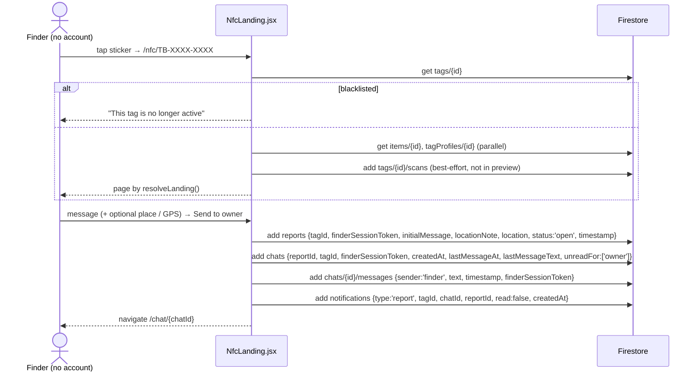
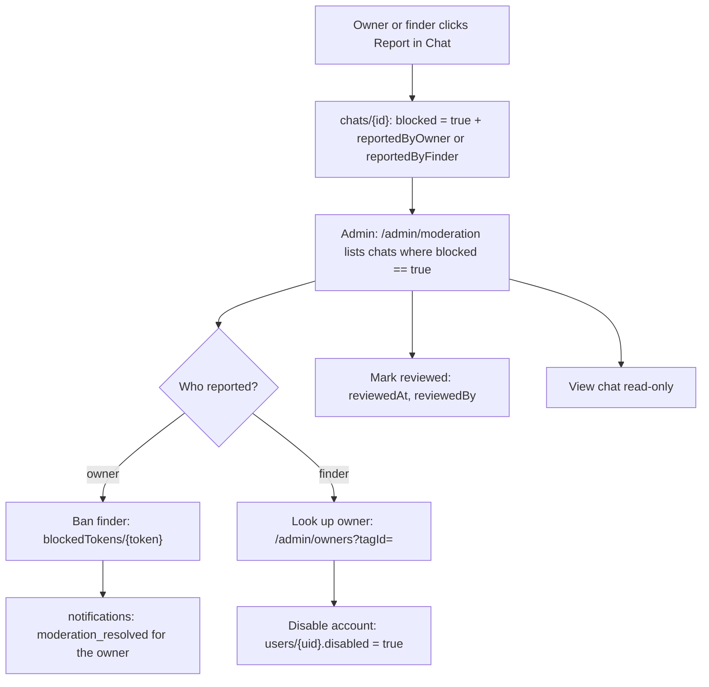
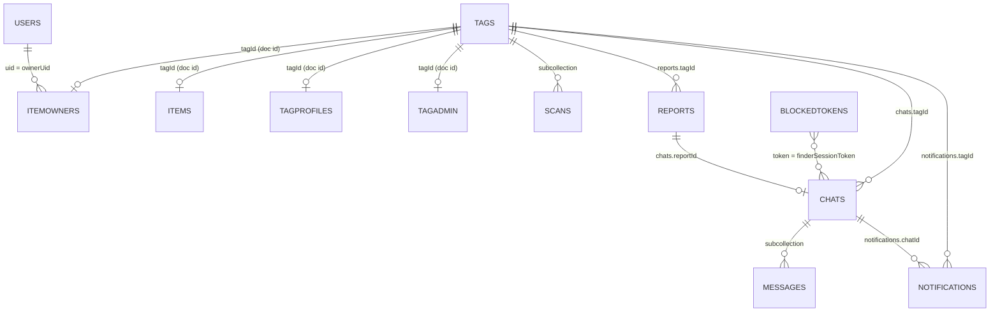
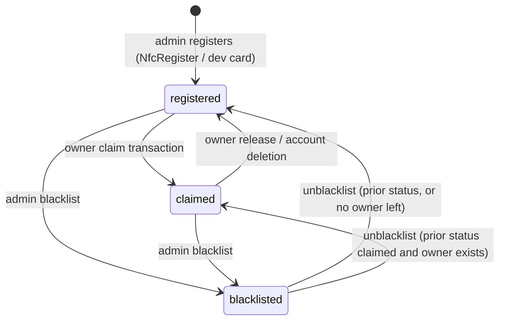

# TagBack — System Documentation

A reference for the **current** TagBack — NFC Lost & Found system. It
describes what the code in this repository does today: UI, features,
workflows, business logic, data, authentication, NFC, privacy and security.

- **Source of truth:** the code. Where a plan, README or ARCHITECTURE note
  disagrees with the code, this document follows the code and records the
  difference in [§26 Known gaps and inconsistencies](#26-known-gaps-and-inconsistencies).
- **Snapshot:** branch `tag-content-security-audit`, UI/UX Round 2 Parts A
  and B (2026-09-29). `npm test` passes 107/107
  rules and flow tests.
- **Related files:** [`README.md`](README.md) (setup),
  [`ARCHITECTURE.md`](ARCHITECTURE.md) (short system overview),
  [`docs/FIREBASE_SETUP.md`](docs/FIREBASE_SETUP.md) (project setup),
  [`docs/README.md`](docs/README.md) (plans and audits history).

### Status labels

| Label | Meaning |
|---|---|
| `Implemented` | Present in the code and reachable from the UI (or, for rules, enforced). |
| `Partially Implemented` | Present, but with a missing part, a limitation, or only in some paths. |
| `Planned` | Described in a plan document, not in the code. |
| `Not Implemented` | Not in the code, and no active plan. |
| `Unclear / Requires Verification` | Code exists, but its real-world behavior depends on something this document can't verify from the repository (device, browser, Firebase console settings). |

### Contents

1. [System Overview](#1-system-overview)
2. [Technology Stack](#2-technology-stack)
3. [User Roles](#3-user-roles)
4. [UI Documentation](#4-ui-documentation)
5. [Route Map](#5-route-map)
6. [Feature Inventory](#6-feature-inventory)
7. [End-to-End Workflows](#7-end-to-end-workflows)
8. [Business Logic](#8-business-logic)
9. [Database Documentation](#9-database-documentation)
10. [Firebase Authentication](#10-firebase-authentication)
11. [Firestore Operations](#11-firestore-operations)
12. [Security Rules and Privacy Logic](#12-security-rules-and-privacy-logic)
13. [NFC Architecture](#13-nfc-architecture)
14. [State Management](#14-state-management)
15. [Component Architecture](#15-component-architecture)
16. [Function-Level Documentation](#16-function-level-documentation)
17. [Error Handling](#17-error-handling)
18. [Loading and Empty States](#18-loading-and-empty-states)
19. [UI → Function → Database Mapping](#19-ui--function--database-mapping)
20. [User Journeys](#20-user-journeys)
21. [Security & Privacy Threat Considerations](#21-security--privacy-threat-considerations)
22. [Responsive UI Behavior](#22-responsive-ui-behavior)
23. [Accessibility and UX](#23-accessibility-and-ux)
24. [File-to-Feature Map](#24-file-to-feature-map)
25. [Current System Status](#25-current-system-status)
26. [Known Gaps and Inconsistencies](#26-known-gaps-and-inconsistencies)

---

## 1. System Overview

### What TagBack is

TagBack is a web application for recovering lost belongings. An owner puts
a TagBack NFC sticker on an item. If the item is lost, the person who finds
it taps the sticker with a phone. The phone opens a web page (no app, no
account) where the finder can message the owner and, optionally, share a
location. Owner and finder talk in an anonymous chat. Neither side sees the
other's name, email, phone number or address.

### Problem it solves

- A finder usually has no safe way to reach the owner of a found item.
- Writing a phone number or email on an item exposes personal data to
  anyone who picks it up.
- TagBack gives the finder a contact channel while the owner's identity
  stays in a private database record that finders can't read.

### Main users

| Role | Has an account? | Summary |
|---|---|---|
| Owner | Yes (email/password) | Claims tags, names items, turns Lost Mode on/off, chats with finders, marks items recovered, releases tags. |
| Finder | No | Taps a tag, reads the public item page, files a found report, chats with the owner. |
| Admin | Yes (email/password + admin right) | Registers and writes physical stickers, manages inventory and tag content, moderates reported chats, looks up and disables owners. |

Full details: [§3 User Roles](#3-user-roles).

### Overall concept

  subgraph Firebase
    AUTH["Firebase Auth"]
    FS[("Firestore<br/>+ security rules")]
  end
  S -- phone tap opens URL --> F
  F -- public reads, finder writes --> FS
  O -- signed-in reads/writes --> FS
  A -- admin reads/writes --> FS
  O --> AUTH
  A --> AUTH
```

- There is **no backend server** and **no Cloud Functions** (the project
  uses the Firebase Spark plan). The browser talks to Firestore and
  Firebase Auth directly through the Firebase JS SDK.
- `firestore.rules` is the security boundary. Route guards in the app
  (`ProtectedRoute`, `AdminGate`) only control what the UI shows.

### How NFC connects the item to the system

- An admin registers each physical sticker. Registration mints a
  **TagBack ID** (`TB-XXXX-XXXX`) and creates `tags/{tagId}`.
- The admin writes one NDEF URL record to the sticker:
  `{origin}/nfc/{TagBack ID}`.
- Any phone that opens NFC URL records (this depends on the phone's OS,
  not on TagBack) opens that URL in a browser. No app is needed for the
  finder.
- What the page shows is stored in Firestore (`tagProfiles/{tagId}`), so it
  can change without rewriting the sticker. See [§13 NFC Architecture](#13-nfc-architecture).

### How the privacy-preserving process works (Implemented)

1. Public item data (`items/{tagId}`: item name, Lost Mode, message,
   reward) and the owner link (`itemOwners/{tagId}`: `ownerUid`) are in
   **separate collections**. Finders can read the first, never the second.
2. The finder has no account. A random token in the browser's
   `localStorage` (`reclaim_finder_token`) identifies the finder in chats.
3. Reports, chats and notifications are keyed by `tagId`, not by owner. The
   owner finds them by first listing their own `itemOwners` rows, then
   querying by those tag IDs.
4. Optional finder location is rounded to 4 decimals (about 11 m) before
   it is stored, and cleared from the report when the owner marks the item
   recovered. Place text the finder types goes into the chat message and
   stays with the chat.

### Implemented vs planned (summary)

| Topic | Implemented | Not implemented / planned |
|---|---|---|
| Notifications | In-app list, unread badge, browser tab title count | Push notifications, email notifications (need a server) |
| Finder identity | Browser-local token | Stronger identity (Firebase App Check is mentioned as the fix in `ARCHITECTURE.md` §11) |
| NFC | Web NFC scan/write in browsers that expose `NDEFReader` | Scanning/registering on iPhone browsers |
| Link previews | One static Open Graph preview for all links | Per-tag previews (need server rendering) |
| Incident history | Current open reports only | A history view of recovered incidents (noted as a limitation in `Dashboard.jsx`) |
| QR / link tags | — | `docs/TAG_CONTENT_BEYOND_STICKERS_PLAN.md` — cancelled |
| Analytics page | Tap counters only | Admin analytics page (`AdminSidebar.jsx` comment: "Analytics (§4.14) isn't built yet") |

---

## 2. Technology Stack

Verified against `package.json`, `vite.config.js`, `firebase.json`,
`src/index.css` and imports in `src/`.

| Technology | Version (package.json) | Why it is used | Where | What depends on it |
|---|---|---|---|---|
| React | `^18.3.1` | UI library | All of `src/` | Every page and component |
| React DOM | `^18.3.1` | Renders into `#root` | `src/main.jsx` | App start |
| Vite | `^6.0.7` | Dev server and build; `@` alias to `src/` | `vite.config.js` | `npm run dev`, `npm run build` |
| @vitejs/plugin-react | `^4.3.4` | JSX/React Fast Refresh for Vite | `vite.config.js` | Build |
| react-router-dom | `^6.28.1` | Client-side routing, nested layouts, route state | `src/App.jsx`, all pages | Navigation, route guards, `?tagId=` / `?preview=1` query params |
| Firebase JS SDK | `^11.1.0` | Auth + Firestore client | `src/firebase/config.js`, `src/lib/*`, pages | All persistence, sign-in, rules-gated access |
| Firebase Authentication | (in `firebase`) | Email/password accounts, email verification, password reset, re-authentication | `SignupForm.jsx`, `Login.jsx`, `AdminLogin.jsx`, `AuthContext.jsx`, `lib/emailVerification.js`, `lib/account.js` | Owner and admin identity |
| Cloud Firestore | (in `firebase`) | Database; `onSnapshot` live listeners; transactions; batched writes; count aggregation | `src/lib/ownerItems.js`, `moderation.js`, `adminOwners.js`, pages | All data |
| Firestore Security Rules | `firestore.rules` | Access control (the only server-side enforcement) | Deployed with `firebase deploy` | Privacy model, claim/release integrity |
| Firebase Hosting | `firebase.json` | Serves `dist/`, SPA rewrite, cache and security headers | `firebase.json` | Production site (`README.md` names `https://nfc-lost-and-found.web.app`) |
| Web NFC (`NDEFReader`) | Browser API, no package | Read NDEF + serial number; write URL record | `ClaimTag.jsx`, `NfcRegister.jsx` | Tap-to-claim, sticker registration and writing |
| Tailwind CSS | `^3.4.17` | Utility styling, dark mode (`class`), custom neumorphic shadows | `tailwind.config.js`, `src/index.css`, all JSX | Look and responsive layout |
| tailwindcss-animate | `^1.0.7` | Animation utilities for Radix components | `tailwind.config.js` | Dialog/Sheet/Dropdown transitions |
| PostCSS + Autoprefixer | `^8.5.1`, `^10.4.20` | CSS pipeline | `postcss.config.js` | Build |
| Radix UI primitives | checkbox, dialog, dropdown-menu, label, radio-group, select, slot, switch | Accessible headless components (shadcn/ui style wrappers) | `src/components/ui/*` | Dialogs, menus, forms, drawer (`Sheet` uses the dialog primitive) |
| class-variance-authority, clsx, tailwind-merge | `^0.7.1`, `^2.1.1`, `^3.6.0` | Button variants and class merging (`cn()`) | `src/components/ui/button.jsx`, `src/lib/utils.js` | All styled components |
| lucide-react | `^0.453.0` | Icons | Everywhere | Icons only |
| sonner | `^2.0.8` | Toast notifications | `App.jsx` (`<Toaster position="top-center" richColors closeButton />`), pages | Success/error feedback |
| Leaflet + react-leaflet | `^1.9.4`, `^4.2.1` | Map of the finder-shared location | `src/components/ReportLocationMap.jsx` | Owner Dashboard incident cards, owner view of Chat |
| OpenStreetMap tiles | External service | Map tiles | `ReportLocationMap.jsx` (`https://{s}.tile.openstreetmap.org/...`) | Map display |
| nanoid | `^5.0.9` | Random IDs | `lib/tags.js` (`customAlphabet` → TagBack IDs), `lib/finderSession.js` (`nanoid(24)` finder token) | Tag identity, finder identity |
| Browser Geolocation API | Browser API | Finder location | `src/lib/geolocation.js` | Optional location on found reports |
| Google Fonts (Inter) | External stylesheet | Font | `src/index.css` `@import` | Typography |
| Vitest | `^5.0.2` | Test runner | `tests/*.test.js` | `npm test` |
| @firebase/rules-unit-testing | `^4.0.1` | Rules tests against the emulator | `tests/*.test.js` | Rules verification |
| firebase-tools | `^15.30.0` | Emulator, deploy | `package.json` scripts | `npm test`, deploys |
| firebase-admin | `^14.5.0` | Service-account scripts (not in the web bundle) | `scripts/*.js` | Granting the admin claim, backups, migrations |
| GitHub Actions | `.github/workflows/ci.yml` | CI: build + tests on push/PR | CI | Release process (`DEPLOY.md`) |

**Not used** (verified absent from `package.json` and `src/`): Google Maps,
Recharts, TypeScript, a state library (Redux, Zustand, etc.), Cloud
Functions, Firebase Storage, Firebase App Check, Firebase Cloud Messaging.

---

## 3. User Roles

Roles are not stored in one "role" field. They come from these facts:

- **Owner** = a signed-in Firebase Auth user. For a given tag, "owner of
  that tag" = `itemOwners/{tagId}.ownerUid == uid`.
- **Admin** = signed-in user with either the custom claim `admin: true`
  (set by `scripts/setAdmin.js`), or `users/{uid}.isAdmin == true` **and**
  a verified email. Never admin while `users/{uid}.disabled == true`.
- **Finder** = anyone holding a chat's `finderSessionToken` in their
  browser's `localStorage`.
- **Viewer** = anyone else who opens a chat link (read-only).

| Role | Description | Permissions (enforced by `firestore.rules`) | Main functions |
|---|---|---|---|
| Guest (not signed in) | Any visitor | Read public docs by ID (`tags`, `items`, `tagProfiles`, `chats`, messages); create reports, chats, messages (with a finder token), notifications, scan records, client error reports | Landing, Privacy, sign in, sign up, open a tag page |
| Finder | A guest (or a signed-in user) who files a found report on a tag they don't own | Create `reports` and `chats` with their token; send chat messages where their token matches the chat; update only `lastMessageAt`/`unreadFor` on their chat; report the owner once (`reportedByFinder`) | File found report, share location, chat, report owner |
| Owner | Signed-in user; owner of each tag they claimed | Claim a `registered` tag (needs verified email); read/write own `items`, `tagProfiles`; read/update/delete reports, chats, notifications on own tags; send owner messages; delete own `users` doc (unless disabled) | Claim tags, Lost Mode, tap page, inbox, recover, release, delete account |
| Admin | Custom-claim admin, or verified passcode admin | Everything guarded by `isAdmin()`: list/write `tags`, `tagAdmin`, `blockedTokens`, `meta`; list `items`, `tagProfiles`, `chats`, `itemOwners`; read/update any `users` doc; write any `tagProfiles`; mark chats reviewed; read/delete `clientErrors` | Register/write stickers, inventory, blacklist, tag content, moderation, owner lookup/disable, passcode, error log |
| Unverified passcode admin | Created with the passcode, email not verified yet | Same as an owner (no admin rights) until the email is verified | Only `/admin/verify-email` in the admin area |
| Disabled account | `users/{uid}.disabled == true` (set by an admin) | Not admin; `ownsTag()` returns false, so every owner action is refused; can't claim | Signed out by the app when the flag is seen |
| Viewer | Opens `/chat/:chatId` without owning the tag or holding the token | Can read the chat and messages (rules allow `get`/read by ID to anyone) | Read-only chat view |

Notes:
- An admin can also use `/dashboard` as an owner; `ProtectedRoute` only
  checks sign-in.
- A signed-in owner who files a report on **someone else's** tag is the
  **finder** in that chat (`Chat.jsx` decides the role per chat).

---

## 4. UI Documentation

Shared behavior on every page:

- **Toasts:** `sonner`, top-center, with a close button.
- **Offline banner:** `OfflineBanner.jsx` shows "You're offline — changes
  will send when you reconnect." at the top while `navigator.onLine` is
  false.
- **Lazy-page errors:** `RouteErrorBoundary.jsx` shows "Failed to load this
  page." with **Retry** (reloads).
- **Crashes:** `ErrorBoundary.jsx` (wraps the whole app) shows "An
  unexpected error occurred.", the error stack, and **Reload Page**. Both
  boundaries call `reportError()`.
- **Preview mode:** when Firebase env vars are missing (`firebaseReady ===
  false`), many pages show mock data and skip writes. Details per page
  below.
- **Page title:** `PageHeader` / `setPageTitle()` sets
  `"<Page> · TagBack"`; the owner console prefixes the unread chat count,
  e.g. `(2) Messages · TagBack`.

### 4.1 Public pages

#### Landing

- **Purpose:** explains TagBack and sends visitors to sign up or sign in.
- **Route:** `/`
- **Accessible by:** everyone.
- **UI elements:**
  - `TopNav variant="landing"`: TagBack logo (link to `/`), **Sign in**
    (`/login`), **Get Started** (`/register`).
  - Hero: badge "NFC-powered Lost & Found", heading "Tap a tag. Bring it
    back.", short description.
  - Card with **Create a free account** (`/register`) and **I have an
    account — sign in** (`/login`).
  - Finder hint: "Found something with a TagBack sticker? Hold your phone
    against the sticker…"
  - "What is TagBack?" text and three highlight cards (No app required,
    Anonymous chat, Privacy by design).
  - "How it works": 4 steps (Get a registered tag, Claim & protect, Arm
    Lost Mode, Tap/report/reconnect).
  - Footer links: **Privacy** (`/privacy`), **Admin** (`/admin/login`).
- **User actions:** links only. No forms, no data access.
- **Loading / empty / error:** none (static page, eagerly loaded).

#### Login (owner sign-in)

- **Purpose:** owner sign-in and password reset.
- **Route:** `/login`
- **Accessible by:** everyone.
- **UI elements:** `TopNav` with a back button; heading "Welcome back";
  **Email** and **Password** inputs (password has a show/hide eye button);
  error line; success notice; **Sign in** button; **Forgot password?**
  button; "No account? Create one" link. In preview mode: "Firebase not
  configured — sign-in is stubbed for preview."
- **User actions:**
  - **Sign in** → `signInWithEmailAndPassword(auth, email, password)`.
    Success → navigate to `location.state.from` (path + search) if a guard
    sent the user here, else `/dashboard`. Preview mode → `/dashboard`
    without signing in.
  - **Forgot password?** → needs the Email field filled
    ("Type your email above first, then tap “Forgot password?”.") →
    `sendPasswordResetEmail(auth, email)` → notice "If an account exists
    for {email}, a reset link is on its way. Check your inbox and spam
    folder."
- **UI state:** idle → **Signing in…** (button spinner, disabled) →
  navigate, or error text from `friendlyAuthError()` (for example
  "Incorrect email or password.").
- **Validation:** HTML `required` on both inputs; Firebase errors mapped by
  `friendlyAuthError()` (see [§17](#17-error-handling)).
- **Note:** this page doesn't check admin status. An admin who signs in here
  lands on the owner dashboard.

#### Register (owner sign-up)

- **Purpose:** create an owner account.
- **Route:** `/register`
- **Accessible by:** everyone.
- **UI elements:** `TopNav`; heading "Create account"; `SignupForm` (owner
  mode): **Name**, **Email** (hint "We’ll send a link here. You need it to
  claim tags."), **Confirm email**, **Password** (show/hide, strength bar
  Weak/Medium/Strong, live 5-item requirement checklist), **Confirm
  password** (show/hide, "Passwords match / do not match"), form error,
  **Create account** button, Privacy link; "Have an account? Sign in".
- **User actions:** **Create account** → validation → Firebase Auth user →
  `users/{uid}` → verification email → `/dashboard/verify-email`.
  Workflow: [§7.1](#71-registration-workflow-owner).
- **Validation** (client, `SignupForm.jsx`):

  | Field | Rule | Message |
  |---|---|---|
  | Name | required | "Enter your name." |
  | Email | required | "Enter your email." |
  | Confirm email | required; equal to Email after trim + lower-case | "Type the email again." / "The two emails don’t match." |
  | Password | all 5 requirements: ≥8 chars, upper, lower, number, special | "Your password doesn’t meet every requirement below yet." |
  | Confirm password | required; equal to Password | "Type the password again." / "The two passwords don’t match." |

  The first invalid field gets focus. Firebase errors (for example
  `auth/email-already-in-use` → "An account already exists with that
  email.") show as the form error.
- **UI state:** idle → **Creating account…** → toast "Account created.
  Check your email to verify it." (or "Account created." if the email
  failed) → verify page.

#### Privacy

- **Purpose:** plain-language list of what is stored and who sees it.
- **Route:** `/privacy`
- **Accessible by:** everyone.
- **UI elements:** "In short" card (what we store / who sees it / how to
  delete it); sections for Owners, Finders, Everyone; "How long, and
  deleting it".
- **User actions:** none. Static.
- **Note:** also says a chat can be read by anyone with its link, and that
  text typed in a chat stays in the chat.

#### Finder tag page (`NfcLanding`)

- **Purpose:** what a tap on a sticker opens. Shows the item's public info
  or the tag's content, and lets a finder report the item found.
- **Route:** `/nfc/:tagId` (optional `?preview=1` from editor preview links)
- **Accessible by:** everyone; no sign-in needed.
- **Page states** (the `state` variable):

  | State | When | What the page shows |
  |---|---|---|
  | `loading` | Initial reads running | Full-page loader "Opening this TagBack tag…" |
  | `blacklisted` | `tags/{id}.status == 'blacklisted'` | "This tag is no longer active" — can't accept reports or messages |
  | `unclaimed` | Tag `registered`, and no admin profile/redirect content | "This tag isn't claimed yet": signed in → **Claim this tag** (`/dashboard/items/claim?tagId=…`); signed out → **Sign in to claim** (login with return path) and "No account? Create one" |
  | `profile` | Landing resolves to `profile` | Profile card: initial avatar, display name, bio, link pills, **Save contact** (downloads `.vcf`), and **Found this item? Message the owner** when the tag is claimed and `lostFoundEnabled !== false` |
  | `redirecting` | Redirect set by an admin (`editorRole == 'admin'`) | "Opening link…" spinner, then `window.location.replace(url)` |
  | `leaving` | Redirect set by the owner | "You're leaving TagBack" page with the host name, the full URL, and **Continue to {host}** |
  | `ready` | Lost & Found page (default, and always while Lost Mode is on) | See below |
  | `notfound` | No tag doc and no item doc, or a read failed | "Tag not recognized" + **What is TagBack?** |

- **Lost & Found (`ready`) UI elements** (order: item → message → optional place → send → links → privacy):
  - Item card: "You found a TagBack item", the item name as heading, badge
    "Reported lost by its owner" (red card) or "Belongs to a TagBack user";
    reward badge `Reward ₱…` when Lost Mode and reward > 0; "Message from
    the owner" box; "Send the owner a message below. You don't need an app
    or an account."
  - If `lostFoundEnabled === false`: "The owner has turned off found-item
    messages for this tag." (no form).
  - Report form:
    - **Message the owner** textarea (required, max 500, live counter
      `n/500`, hint "This starts a private chat with the owner…"; empty
      submit shows an inline error and focuses the field).
    - **Add where it is (optional)** button, which opens the "Where is it
      now?" block: **Describe the place** input (max 200, "Sent to the owner
      as part of your message.") and **Share my current location** (spinner
      while locating → "Update my location", plus **Remove location**).
    - Location status line (see [§7.8](#78-location-sharing-workflow)).
    - **Send message to owner** button, full width (red variant while Lost
      Mode is on).
  - Link pills card (moved below the form).
  - "Your privacy" list: no app/account; messages go through TagBack and
    neither side sees the other's phone or email; location optional; don't
    share personal details unless you want to; link to `/privacy`.
- **User actions:**
  - **Share my current location** → `captureLocation()`; the coordinates are
    kept only for the report (not copied into any text field).
  - **Send message to owner** → empty message → inline error "Write a short
    message to the owner first, e.g. where you found it." Otherwise: create
    report → chat → first message → notification → navigate to
    `/chat/{chatId}`. Workflow:
    [§7.6](#76-finder-workflow-found-report).
- **Side effects:** each non-preview view writes one
  `tags/{tagId}/scans` record (best-effort) with the landing mode shown.
  The browser tab title becomes the display name or item name.
- **Error states:** submit failure → toast. `permission-denied` (for example
  a banned token or blacklisted tag) → "This device can't file reports
  right now."; other errors use `friendlyFirestoreError()` with fallback
  "Could not send report. Please try again."
- **Preview mode:** shows a mock lost backpack; **Send message to owner** goes to
  `/chat/preview-{tagId}`.

#### Chat

- **Purpose:** anonymous two-way chat about one found report.
- **Route:** `/chat/:chatId`
- **Accessible by:** anyone with the link. The role decides what the
  viewer can do:

  | Role | Condition (`Chat.jsx`) | Can write? | Header subtitle |
  |---|---|---|---|
  | `admin` | `checkIsAdmin(user)` and does not own the tag | No | "Admin view · read-only" (+ "Admin" badge) |
  | `owner` | Signed in and the chat's `tagId` is in the user's own tag IDs | Yes | "Chat with the finder · contact details hidden" |
  | `finder` | `chat.finderSessionToken === getFinderToken()` | Yes | "Chat with the owner · contact details hidden" |
  | `viewer` | Anyone else | No | "Read-only" |

- **UI elements:**
  - Header: back button (owner → `/dashboard/messages`, others → `/`),
    item name (or "Anonymous chat"), role subtitle, **Recovered** badge when
    `chat.resolved`, report icon button (owner: "Report this finder";
    finder: "Report the owner"), replaced by a red "You reported this
    chat" icon after reporting.
  - Connection warning: "Connection problem — new messages may not show."
    + **Retry** (re-subscribes listeners).
  - Viewer notice: "You can read this chat, but not reply from here." with
    a reason; signed-out viewers get **Sign in as owner**; in-app browsers
    get "open it in Chrome instead".
  - Finder tip (dismissible, per chat, stored in `localStorage`): "The
    owner has been notified…open it again in this same browser to reply."
    + **Copy link**, **Got it**.
  - Recovered notice: "Marked as recovered. You can still message here to
    finish the handoff."
  - Owner only: pinned "Finder's report" card with time, recovery stepper
    (Lost → Found → Talking → Recovered), location note, and the map (lazy
    loaded).
  - Message list: day separators (Today / Yesterday / date), sender label
    at the start of each run ("Owner"/"Finder"), own messages on the right
    in purple, time and a check mark when sent, "Sending…" while pending,
    "Not sent. {reason} Retry" for rejected sends. Scroll-to-latest button
    when not at the bottom.
  - Empty thread: "No messages yet. Say hello to get started."
  - Composer (owner/finder; shown disabled as "Connecting…" until the role
    is known): owner-only "Got your item back? **Mark as recovered**" bar;
    quick-reply chips (different per side); auto-growing textarea (max
    1000, up to ~4 lines); **Send** icon button. Enter sends on devices
    with a fine pointer; Shift+Enter or a phone keyboard adds a new line.
  - Dialogs: "Mark this item as recovered?" (lists the 3 effects; Cancel
    focused first) and "Report this conversation?" (reason textarea).
- **User actions:**
  - **Send** → message appears at once as "Sending…" →
    `sendChatMessage()` → sent, or a "Not sent" bubble with **Retry**.
    `permission-denied` reason: "This device can't send messages in this
    chat."
  - **Mark as recovered** → confirm → `markRecovered()` → toast "Marked as
    recovered. Lost Mode is off."
  - **Report** → reason (optional) → **Report chat** →
    `reportChat()`/`reportChatAsFinder()` → toast "Chat reported for
    review."
  - Opening the chat marks it read for the viewer's side
    (`markChatRead(chatId, role)`), only for owner/finder.
- **Error / missing:** chat doc doesn't exist → "This conversation isn't
  available" ("The link may be incomplete, or the item's owner released
  the tag.") + **Go to Messages** (signed in) or **Go to TagBack**.

### 4.2 Owner console

#### Dashboard layout (shell for all `/dashboard/*` pages)

- **Guard:** `ProtectedRoute` (signed in).
- **Elements:** desktop left rail (≥ `md`): brand, nav (Home, My Items,
  Messages with unread-chat count badge, Notifications with a dot,
  Settings), user email, **Log out**. Phone: sticky top bar with the
  current section name and a menu button (dot when something is unread)
  that opens a left drawer with the same nav and **Log out**; fixed bottom
  tab bar (Home, My Items, Messages, Alerts). "Skip to content" link.
- **Verify banner:** on every owner page except the verify page, while the
  email is unverified: "Verify your email to claim tags" + **Verify now**.
- **Background work:** one shared `itemOwners` listener
  (`OwnerTagIdsProvider`), shared notifications + chats listeners
  (`OwnerNotificationsProvider`), email verification polling
  (`useVerificationWatch`), `?verified=1` handling.

#### Dashboard (Home)

- **Route:** `/dashboard`
- **Purpose:** summary of the owner's items and anything that needs a
  reply.
- **UI elements:**
  - Header "Hi, {first name}" (or "Home"); description changes when items
    were found; **Claim a tag** button.
  - Three stat tiles (links): Items tagged → `/dashboard/items`; In Lost
    Mode → `/dashboard/items?filter=lost`; Open reports →
    `/dashboard/messages?filter=open`.
  - **First run** (no items): "Get started in three steps" (four when the
    email is unverified: Verify your email first), main button **Verify my
    email** or **Claim your first tag**, privacy line.
  - **Needs your reply:** one card per open report: item name, "Reported
    {time}", "Found — report open" badge, recovery stepper, location map,
    latest message quote, **Reply to finder** (or **Open Messages** when no
    chat was found).
  - **All clear** card when there are items but no open reports.
  - Stale reminders: items in Lost Mode for more than 14 days with no open
    report: "Still missing: {item}" + **Update** + dismiss (X). Dismissal
    is saved to `users/{uid}.staleNudgeDismissed.{tagId}` = the
    `lostSince` millis, so it reappears if the item is marked lost again.
  - Recent activity: latest 3 notifications, **See all**.
- **Loading:** stat skeletons and a large skeleton block.
- **Errors:** dismiss failure → toast "Could not dismiss this reminder."

#### My Items

- **Route:** `/dashboard/items` (optional `?filter=lost`)
- **Purpose:** list of claimed items and their actions.
- **UI elements:**
  - Header + **Claim a tag** (when at least one item exists).
  - Search input (only when 6+ items): matches item name or TagBack ID.
  - "Showing lost items only · Show all" when `?filter=lost`.
  - Item card: name; status badge (`Flagged by admin` / `Found — report
    open` / `Lost` / `Protected`); category with icon; TagBack ID; tap count
    (eye icon, when > 0); lost message and reward line while lost. Red
    border in Lost Mode; purple ring on the item just claimed (with "Tag
    claimed" notice).
  - ⋯ menu: **Edit tap page** (`/dashboard/nfc-setup?tagId=…`), **Preview
    what finders see** (`/nfc/{id}?preview=1` in a new tab), **Release
    tag…** (hidden for blacklisted tags).
  - Action buttons: **Reply to finder** (when an open report has a chat);
    Lost Mode on → **Edit lost message**, **I have it back**; Lost Mode off
    and no chat → **Report lost**.
  - Blacklisted tag: "An admin flagged this tag, so finders can't report or
    message on it…" and no action buttons.
  - Dialogs: "Report "{name}" as lost" (message ≤ 500 with counter, reward
    in ₱ 0–1,000,000, "Finders will see" preview, **Turn on Lost Mode**);
    "Turn off Lost Mode for …?"; "Release …?" (irreversible, lists what is
    deleted).
- **User actions / toasts:**
  - Turn on: "Lost Mode is on. Anyone who taps the tag now sees your
    message."
  - Turn off: "Lost Mode is off." (message and reward are kept for next
    time).
  - Release: "Tag released. It can be claimed again with the same TagBack
    ID." Errors: blacklisted → "This tag is blacklisted and cannot be
    released. Contact the admin."; partial → "This tag's reports, chats and
    alerts were cleared, but releasing it failed. It's still yours — try
    Release again."
- **Empty:** "No items yet" + **Claim your first tag**. Search/filter with no
  match: "No items match "{term}"" or "Nothing is lost".
- **Loading:** 3 skeleton cards.
- **Edit item…** (⋯ menu): dialog to rename the item or change its
  category (`updateItemDetails`), same fields and validation as the claim
  page. A **Recovered** section lists chats marked recovered.
- **Load failure:** `LoadErrorState` (offline / no access / couldn't load)
  with **Try again**, instead of the empty state.

#### Claim a tag

- **Route:** `/dashboard/items/claim` (optional `?tagId=`)
- **Purpose:** link a registered sticker to the signed-in account.
- **Gate:** if the email is not verified: empty state "Verify your email
  first" + **Verify my email** (the form is not shown).
- **UI elements:**
  - Card 1 "Find your tag": `NfcScanPanel` when `'NDEFReader' in window`,
    else the notice "Scanning isn’t available in this browser. Tap-to-scan
    works in Chrome on Android…". **TagBack ID** input (monospace, upper
    case, prefilled from `?tagId`).
  - Card 2 "Describe the item": **Item name** (max 100, hint "Finders see
    this name."), **Category** select (Luggage, Keys, Wallet, Tech, Bike,
    Pet, Other), form error, **Claim tag**.
- **Scan panel states:** idle ("Tap your tag" + **Start scanning**) →
  scanning (pulse animation, **Cancel**, 30 s timeout) → `detected` ("Tag
  detected — TagBack ID … — now name the item below", focus moves to Item
  name) | `unreadable` ("That tag isn't a TagBack tag") | `error` ("No tag
  detected" + tips) | `denied` ("NFC permission is blocked") | `timeout`
  ("Stopped looking for a tag"); failures offer **Try again**.
- **Validation:**

  | Field | Rule | Message |
  |---|---|---|
  | TagBack ID | required; after `normalizeTagbackId()` must match `^TB-[A-Z0-9]{4}-[A-Z0-9]{4}$` | "Enter the TagBack ID, or scan the tag." / "That doesn’t look like a TagBack ID. It looks like TB-ABCD-2345." |
  | Item name | required | "Give the item a name, e.g. “Black backpack”." |
  | Category | required | "Choose a category." |

- **Transaction errors** (form error): "No tag has this ID…", "This tag has
  been blocked by TagBack and cannot be claimed.", "This tag already
  belongs to someone. If it’s yours, ask them to release it first.", "This
  tag is managed by TagBack and cannot be claimed…"; Firestore errors via
  `friendlyFirestoreError()`.
- **Success:** optional warning toast if the scanned hardware serial
  differs from the registered one; toast "{item} is now protected.";
  navigate to `/dashboard/items` with the new item highlighted.

#### Tap page (`NfcSetup`)

- **Route:** `/dashboard/nfc-setup?tagId=…`
- **Purpose:** owner edits what a tap shows (`tagProfiles/{tagId}`).
- **States:** no `tagId` → "Choose an item first" + **Go to My Items**;
  loading → "Loading tap page…"; tag not in the owner's tag IDs or no tag
  doc → "This tag isn't one of your items".
- **UI elements:**
  - Header "Tap page" with **Preview** (`/nfc/{id}?preview=1`, new tab).
  - Info: "Your sticker already points here…"; **Tap link** with copy
    button; "Technical details" (TagBack ID, Physical UID or "not exposed by
    the registering device", Chip).
  - Warning "Last edited by a TagBack admin. Your next save replaces their
    changes." when `updatedBy` is another uid.
  - `TagContentForm` (shared with admin): landing mode radio (Lost & Found /
    Profile card / Redirect); redirect URL; display name (≤ 60) and bio (≤
    160) for profile; **Lost & Found reporting** switch; **Contact link**
    switch + URL; Website, Instagram, Facebook, TikTok, LinkedIn, YouTube
    URLs; live `TapPreview`.
  - Save button (desktop: "Save changes" / "Saved", disabled when
    unchanged); phone: sticky "Unsaved changes" bar with **Save** above the
    tab bar.
  - Browser warns before leaving with unsaved changes (`beforeunload`).
- **Validation** (`validateProfile()`): URL fields must start with
  `https://` ("Enter a valid https:// URL, or leave blank."); display name
  ≤ 60, bio ≤ 160 ("Keep it under N characters."); redirect mode needs a
  URL ("Redirect mode needs a URL.").
- **Save:** `saveTagProfile(tagId, formToProfile(profile))` replaces the
  whole doc → toast "Saved. The next tap shows your changes."

#### Messages

- **Route:** `/dashboard/messages` (optional `?filter=open|resolved`)
- **Purpose:** owner inbox; one row per chat on the owner's tags (archived
  chats hidden).
- **UI elements:** filter tabs All / Open / Recovered; rows with category
  icon, item name (bold + pink dot when unread), latest message preview
  (from the newest real message, max 140 chars), relative time, badge
  (`Under review` if reported and not resolved, else `Open` / `Recovered`).
- **Actions:** clicking a row marks it read for the owner and opens
  `/chat/{id}`.
- **Empty:** "No conversations yet"; filter empty: "No open conversations" /
  "No recovered items yet". **Loading:** 3 skeleton rows.

#### Notifications

- **Route:** `/dashboard/notifications`
- **Purpose:** activity log of alerts.
- **UI elements:** header "{n} new." or "You're all caught up."; **Mark all
  as read** and **Clear read** (buttons on desktop, ⋯ menu on phones); list
  rows with type icon and label ("Someone found your item", "New message",
  "Your report was reviewed"), item name, time, unread dot.
- **Actions:** open a row → mark read → go to its chat (fallback: newest
  chat on that tag, else `/dashboard/messages`). **Mark all as read** →
  toast "All marked as read." **Clear read** deletes read notifications →
  toast "Cleared read notifications."
- **Empty:** "No notifications yet". **Loading:** 3 skeleton rows.

#### Settings (owner)

- **Route:** `/dashboard/settings`
- **UI elements:** Appearance (**Dark mode** switch); Account (email,
  "Email verified"/"Email not verified" badge, **Verify my email**);
  Notifications (text only: alerts are in-app, "Email alerts aren't
  available yet."); Privacy link; Danger zone **Delete my account**.
- **Delete dialog:** type `DELETE`, enter password, progress line ("Checking
  your password…", "Removing tag n of m…", "Deleting your profile…",
  "Deleting your sign-in…"), **Delete account** (disabled until both are
  filled). Success → toast "Your account and its data were deleted." →
  `/`. The dialog can't close while deleting.
- **Silent side effect:** if the profile still has an old `phone` field, it
  is deleted when Settings opens.
- **Not present:** changing display name, email (except through the verify
  page before verification) or password (owner uses **Forgot password?** on
  the login page).

#### Verify email (owner and admin)

- **Routes:** `/dashboard/verify-email` (owner, inside the dashboard
  layout) and `/admin/verify-email` (admin, `AdminVerifyEmail` wrapper,
  signed-in only, outside `AdminGate`).
- **Purpose:** get the account's email verified.
- **UI elements:** "We sent a link to {email}."; 3 steps; "Can't find it?"
  (Spam/Promotions, sender `noreply@nfc-lost-and-found.firebaseapp.com`);
  send error alert; "Not verified yet" alert; **I've verified**; **Resend
  email** (60 s cooldown: "Resend in Ns"); "Wrong email? **Change it**"
  (expands a form: New email, Confirm new email, Current password, **Send
  link to new email**, **Cancel**); "Or **sign up with a different email**"
  (signs out, goes to `/register` or `/admin/register`).
- **Automatic detection:** checks every 5 s while the tab is visible (up to
  10 minutes) and on focus; the email's continue link
  (`/dashboard?verified=1` or `/admin/verify-email?verified=1`) triggers an
  immediate check. Once verified: toast and navigate (owner →
  `/dashboard`, admin → `/admin/inventory`).
- **Change email validation:** new email required and different from the
  current one ("That is the email on the account now."); confirmation
  must match ("The two emails don’t match."); password required. Errors:
  wrong password → next to the password field; already in use / invalid →
  next to the email field; others as a form error.
- **After change is requested:** "Link sent to {new}. The old address stays
  on the account until you click it. After that, sign in with the new
  address."

### 4.3 Admin console

#### Admin login

- **Route:** `/admin/login`
- **UI elements:** amber shield icon, "Admin console"; Email, Password
  (show/hide); error; **Sign in**; links to owner sign-in and admin
  sign-up. Shows a notice passed from `AdminGate` (for example "Your
  account does not have admin access.").
- **Actions:** sign in → `getAdminStatus()`:
  - `admin` → go to the page the gate came from, else `/admin/inventory`.
  - `unverified` → `/admin/verify-email` (stays signed in).
  - `not-admin` → sign out, "This account doesn't have admin access."
  - `unknown` → sign out, "Couldn't check admin access. Check your
    connection and try again."

#### Admin register

- **Route:** `/admin/register`
- **UI elements:** "Create admin account"; `SignupForm admin` (same fields
  as owner + **Admin passcode**, hint "Given to you by an existing
  admin."; email hint mentions the admin console); links to admin sign-in
  and owner sign-up; note that it only creates new accounts.
- **Actions:** see [§7.2](#72-registration-workflow-admin-passcode). Wrong
  or disabled passcode → the new Auth user is deleted and "That admin
  passcode is not correct, or admin signup is turned off. No account was
  created."

#### Admin layout and gate

- **Route:** `/admin/*` except login/register/verify-email.
- **Gate (`AdminGate`):** loading → "Checking admin access…"; signed out →
  `/admin/login`; `unknown` → "Couldn't check admin access" + **Retry**;
  `unverified` → `/admin/verify-email`; `not-admin` → `/admin/login` with
  the notice. Preview mode → renders without checks.
- **Shell:** same `SidebarShell` as owners with an amber "Admin console"
  identity. Nav: Inventory, NFC Register, Tag Content, Moderation, Owners,
  Settings. `/admin` redirects to `/admin/inventory`.

#### Inventory

- **Route:** `/admin/inventory`
- **Purpose:** lifecycle table of all registered stickers.
- **UI elements:**
  - **Register tags** button (`/admin/nfc-register`).
  - KPI tiles: All, Registered, Claimed, Blacklisted (server counts,
    skeleton while loading).
  - Search (TagBack ID or physical UID). If nothing in the loaded rows
    matches, an exact server lookup runs after 400 ms ("Searching full
    inventory…" / "Found beyond the loaded 100…").
  - **Export this view** (CSV of the filtered rows: tagId, physicalUid,
    chipType, status, writeStatus, url).
  - Status filter chips with counts.
  - Selection checkboxes (blacklisted rows not selectable) → **Blacklist
    selected (n)**, **Set content (n)** (only registered tags are sent to
    the bulk editor; the rest are counted as skipped).
  - Table (cards on phones): TagBack ID, Physical UID, Chip, Status badge,
    Write status badge, Content ("Lost & Found" / "Profile · name" /
    "Redirect · host"), Registered (relative time), Owner (**Reveal
    owner** for claimed tags → shows email or uid), Actions ⋯ menu.
  - ⋯ menu: **Edit content**, **Copy URL**, **Retry write** (not written or
    failed), **Re-register sticker**, **Blacklist…** / **Unblacklist**.
  - **Load more** (pages of 100).
  - Blacklist dialog: reason required.
- **Live data:** the first 100 rows (newest registration first) are a live
  listener; later pages are one-time fetches (and freeze the live page).
- **Empty:** "No tags match this view. Register a physical tap to add
  inventory." **Loading:** 5 skeleton rows. **Errors:** form error line
  (for example "Could not load tags. Try again.").

#### NFC Register

- **Route:** `/admin/nfc-register`, also `?rewrite={tagId}` (retry write)
  and `?reregister={tagId}` (replacement sticker).
- **Phases:** `idle` → `scanning` → `preview` (new sticker) or `existing`
  (already registered) → `registered` → write (`writing` → `written` |
  `write_failed`).
- **UI elements:**
  - Unsupported browser: "NFC reading is not supported in this browser.
    Please use Android + Chrome over HTTPS to register physical stickers."
    and a link to **Settings › Developer tools** (test tags).
  - `preview`: "Tag read successfully", Physical UID (or "not exposed by
    this browser/tag"), NFC capability (`uid-and-ndef` / `ndef-only`),
    Chip type radio (NTAG213/215/216), **Cancel**, **Register tag**.
  - `existing`: "This NFC tag is already registered." with its Tag ID,
    status, write status, **Scan another tag**.
  - `registered`: "Registered as TB-…", the URL written to the sticker,
    write result, **Copy TagBack URL**, **Write NFC tag** (NFC browsers
    only; "Hold tag near phone…"), **Set tag content**, **Register
    another** or **Done — back to inventory**.

#### Tag Content (index)

- **Route:** `/admin/tags`
- **UI elements:** TagBack ID input + **Open editor**; mode filter chips (All,
  Lost & Found, Profile card, Redirect); table of non-blacklisted tags
  (TagBack ID, Status, Tap shows, **Edit content**, **Open**); checkboxes
  for registered tags only → **Set content (n)**; **Load more**.
- **Empty:** "No tags in this view." (preview mode: "Preview mode — no
  Firestore configured.").

#### Tag Content (editor)

- **Routes:** `/admin/tags/:tagId` (one tag) and `/admin/tags/bulk` (bulk;
  selection comes from router state and is kept in `sessionStorage`).
- **UI elements:** tag ID, status badge, tap counts ("n taps recorded ·
  Lost & Found a · Profile b · Redirect c"), item name; warning on claimed
  tags ("Your save replaces their content…"); note on registered tags
  (profile/redirect makes it unclaimable); **Open tap page**; shared
  `TagContentForm`; **Save content** / **Apply to n tags**; **Reset
  content** with inline confirmation (deletes the profile).
- **Unavailable states:** "No tags selected", "Tag not found", "This tag is
  blacklisted" (+ **Back to Tag Content**).
- **Saves:** single → `saveTagProfile(..., { editorRole: 'admin' })`;
  bulk → `applyTagProfileToMany()` in batches of 100.

#### Moderation

- **Route:** `/admin/moderation`
- **Purpose:** review chats reported by an owner or finder.
- **UI elements:** KPI tiles (Reported, Reviewed, Banned tokens); search
  (item, reason, token); **Show reviewed** switch; selection → **Mark n
  reviewed**; table: Item, Reason ("Owner: …" / "Finder: …"), Finder token,
  Reported (latest report time), Status badges (Reported by finder/owner,
  Tag released, Finder banned, Reviewed), Actions: **View chat** (eye),
  **Mark reviewed**, **Look up owner** (finder reports), **Ban finder** /
  **Unban** (owner reports).
- **Ban confirmation:** explains that clearing browser data gives a new
  identity. Ban → `blockedTokens/{token}` + owner notification
  `moderation_resolved` → toast "Finder banned. The owner was told their
  report was acted on."
- **Empty:** "Nothing reported"; all reviewed: "All caught up".

#### Owners

- **Route:** `/admin/owners` (optional `?tagId=` auto-runs the lookup)
- **UI elements:** TagBack ID input + **Look up owner**; owner card (name or
  email, Disabled badge, Verified email / Email not verified badge,
  "Sign-up email: …", **Disable account** / **Re-enable account**); details
  (uid, phone or "—", member since); note for unverified accounts older
  than 7 days; "Tags owned" table (Tag ID, Item, Status).
- **Disable dialog:** optional reason; explains that it blocks owner
  actions but doesn't sign out an open session or delete data.
- **Errors:** "That tag exists but has no owner yet (still unclaimed), or
  the tag ID is wrong."; preview mode: "Owner lookup needs a real Firebase
  project…".

#### Settings (admin)

- **Route:** `/admin/settings`
- **UI elements:** Your account (email; "Admin (set by the setup script)"
  or "Admin (signed up with passcode)"; **Change password** = sends a reset
  email; **Log out**); Appearance (Dark mode); Admin access
  (`AdminSignupPasscodeCard`: status on/off, passcode input, **Generate**
  8-char random, **Copy**, **Set passcode**/**Change passcode**, **Turn
  off**); Maintenance (**Error log** link with count); Developer tools
  (`DevTagRegisterCard`: chip type + **Register test tag**).

#### Error log

- **Route:** `/admin/errors`
- **UI elements:** latest 100 `clientErrors`, grouped by message: message,
  `n×` count, latest time, pages; click to expand browser, signed-in uid and
  stack. **Refresh**; **Clear all** (confirm "Clear the whole error log?",
  deletes the loaded reports).
- **Empty:** "No errors reported". **Loading:** 3 skeleton rows.

---

## 5. Route Map

Defined in `src/App.jsx`. Public pages load eagerly; dashboard and admin
pages are lazy chunks (`lazyPage()`), preloaded in idle time once the user
is inside that area (`usePreloadArea`).

| Route | Page (file) | Access | Purpose | Auth required |
|---|---|---|---|---|
| `/` | `pages/Landing.jsx` | Public | Product intro, sign up/in links | No |
| `/login` | `pages/auth/Login.jsx` | Public | Owner sign-in, password reset | No |
| `/register` | `pages/auth/Register.jsx` | Public | Owner sign-up | No |
| `/nfc/:tagId` | `pages/public/NfcLanding.jsx` | Public | What a tap opens; found report | No |
| `/chat/:chatId` | `pages/public/Chat.jsx` | Public (role per chat) | Anonymous chat | No (owner features need sign-in) |
| `/privacy` | `pages/Privacy.jsx` | Public | What is stored | No |
| `/dashboard` | `pages/dashboard/Dashboard.jsx` | `ProtectedRoute` | Home | Yes |
| `/dashboard/items` | `pages/dashboard/Items.jsx` | `ProtectedRoute` | My Items | Yes |
| `/dashboard/items/claim` | `pages/dashboard/ClaimTag.jsx` | `ProtectedRoute` | Claim a tag | Yes (+ verified email to submit) |
| `/dashboard/nfc-setup` | `pages/dashboard/NfcSetup.jsx` | `ProtectedRoute` | Tap page editor (`?tagId=`) | Yes |
| `/dashboard/messages` | `pages/dashboard/Messages.jsx` | `ProtectedRoute` | Inbox | Yes |
| `/dashboard/notifications` | `pages/dashboard/Notifications.jsx` | `ProtectedRoute` | Alerts | Yes |
| `/dashboard/settings` | `pages/dashboard/Settings.jsx` | `ProtectedRoute` | Theme, account, delete account | Yes |
| `/dashboard/verify-email` | `pages/VerifyEmail.jsx` (`role="owner"`) | `ProtectedRoute` | Verify / change email | Yes |
| `/admin/login` | `pages/admin/AdminLogin.jsx` | Public | Admin sign-in | No |
| `/admin/register` | `pages/admin/AdminRegister.jsx` | Public | Admin sign-up with passcode | No |
| `/admin/verify-email` | `pages/VerifyEmail.jsx` (`AdminVerifyEmail`) | Signed in (own guard) | Passcode admin verifies email | Yes |
| `/admin` | → `/admin/inventory` | `AdminGate` | Redirect | Admin |
| `/admin/inventory` | `pages/admin/Inventory.jsx` | `AdminGate` | Tag lifecycle table | Admin |
| `/admin/nfc-register` | `pages/admin/NfcRegister.jsx` | `AdminGate` | Register/write stickers (`?rewrite=`, `?reregister=`) | Admin |
| `/admin/tags` | `pages/admin/TagContentIndex.jsx` | `AdminGate` | Tag content list | Admin |
| `/admin/tags/:tagId` | `pages/admin/TagContent.jsx` | `AdminGate` | Edit one tag's content | Admin |
| `/admin/tags/bulk` | `pages/admin/TagContent.jsx` (`tagId === 'bulk'`) | `AdminGate` | Bulk content | Admin |
| `/admin/moderation` | `pages/admin/Moderation.jsx` | `AdminGate` | Reported chats | Admin |
| `/admin/owners` | `pages/admin/Owners.jsx` | `AdminGate` | Owner lookup / disable (`?tagId=`) | Admin |
| `/admin/errors` | `pages/admin/Errors.jsx` | `AdminGate` | Client error log | Admin |
| `/admin/settings` | `pages/admin/Settings.jsx` | `AdminGate` | Admin account, passcode, tools | Admin |
| `*` | → `/` | Public | Unknown routes | No |

### Redirect behavior

| Situation | Behavior |
|---|---|
| Signed out, opens `/dashboard/*` | `ProtectedRoute` → `/login` with `state.from`; after sign-in, back to that path + query |
| Signed out, opens `/admin/*` | `AdminGate` → `/admin/login` with `state.from` |
| Signed in, not admin, opens `/admin/*` | `/admin/login` with notice "Your account does not have admin access." |
| Passcode admin with unverified email opens `/admin/*` | `/admin/verify-email` |
| Admin status can't be read (offline) | "Couldn't check admin access" + **Retry** (no redirect) |
| Signed out, opens `/admin/verify-email` | `/admin/login` |
| Unclaimed tag, signed out, **Sign in to claim** | `/login` with `state.from = /dashboard/items/claim?tagId=…` |
| Owner **Log out** (sidebar/drawer) | `signOut()` then `/` |
| Admin **Log out** (sidebar or Settings) | `signOut()` then `/` |
| Account deleted | `/` |
| Account disabled while signed in | `AuthContext` shows toast "This account has been disabled." and signs out; guards then redirect to the login page of that area |
| Unknown route | `/` |
| Preview mode (`firebaseReady === false`) | Guards let every page render; login/sign-up buttons navigate without real auth |

Server-side (`firebase.json`): all paths rewrite to `index.html`;
`X-Robots-Tag: noindex, nofollow` on `/chat/**`, `/dashboard`,
`/dashboard/**`, `/admin`, `/admin/**`; `public/robots.txt` disallows
`/chat/`, `/dashboard/`, `/admin/`.

---

## 6. Feature Inventory

| Feature | Status | User | UI location | Main logic | Database interaction |
|---|---|---|---|---|---|
| Owner registration | Implemented | Guest | `/register` | `SignupForm.jsx#onSubmit` | Auth create; `users/{uid}` create |
| Email typed twice | Implemented | Owner, admin | Sign-up forms | `SignupForm.jsx` validation | — |
| Email verification | Implemented | Owner, passcode admin | Verify pages, banners | `lib/emailVerification.js`, `useVerificationWatch` | Auth; `users/{uid}.emailVerified` |
| Change unverified email | Implemented | Owner, passcode admin | Verify page "Change it" | `changeUnverifiedEmail()` | Auth `verifyBeforeUpdateEmail`; later `users/{uid}.email` |
| Login | Implemented | Owner | `/login` | `signInWithEmailAndPassword` | Auth |
| Password reset | Implemented | Owner, admin | Login "Forgot password?", admin Settings | `sendPasswordResetEmail` | Auth |
| Logout | Implemented | Owner, admin | Sidebar / drawer footer, admin Settings | `logout()` → `signOut` | Auth |
| Delete account | Implemented | Owner | Settings → Danger zone | `lib/account.js#deleteMyAccount` | Deletes owned tag data, `users/{uid}`, Auth user |
| Edit display name | Implemented | Owner | Settings → Account → Name | `updateProfile` + `NameForm` | `users/{uid}.displayName` |
| Admin sign-up with passcode | Implemented | Guest | `/admin/register` | `SignupForm admin` | `users/{uid}` with `isAdmin: true` (rules check passcode) |
| Admin custom claim | Implemented (script) | Operator | CLI | `scripts/setAdmin.js` | Auth custom claim |
| Admin passcode management | Implemented | Admin | Admin Settings | `AdminSignupPasscodeCard.jsx` | `meta/adminSignup` set/delete |
| Sticker registration (Web NFC) | Implemented | Admin | `/admin/nfc-register` | `NfcRegister.jsx#startScan/onRegister` | `tags`, `tagAdmin` (transaction) |
| Write URL to sticker | Implemented | Admin | NFC Register | `onWriteTag` (`NDEFReader.write`) | `tags.writeStatus`, `lastWrittenAt`, `lastWriteError` |
| Retry write / re-register sticker | Implemented | Admin | Inventory ⋯ → NFC Register | `?rewrite=` / `?reregister=` | `tags`, `tagAdmin` |
| Test tag without hardware | Implemented | Admin | Admin Settings → Developer tools | `DevTagRegisterCard.jsx` | `tags`, `tagAdmin` |
| Inventory list, counts, search, CSV | Implemented | Admin | `/admin/inventory` | `Inventory.jsx` | `tags` list + counts, `tagProfiles` by ID |
| Blacklist / unblacklist | Implemented | Admin | Inventory | `onConfirmBlacklist`, `onUnblacklist` | `tags.status`, `tagAdmin` |
| Reveal owner in inventory | Implemented | Admin | Inventory "Reveal owner" | `findOwnerByTag` | `itemOwners`, `users` |
| Tag claim by NFC scan | Implemented (Web NFC browsers) | Owner | `/dashboard/items/claim` | `ClaimTag.jsx#scanNfc` | — (fills the ID) |
| Tag claim by typed ID | Implemented | Owner | `/dashboard/items/claim` | `ClaimTag.jsx#onSubmit` transaction | `tags`, `itemOwners`, `items`, `tagProfiles` read |
| Claim from a tap on an unclaimed tag | Implemented | Owner | `/nfc/:tagId` → claim page | `NfcLanding` `unclaimed` state | `tags`, `tagProfiles` read |
| Hardware ID mismatch warning | Implemented | Owner | Claim toast | `ClaimTag.jsx` | `tags.physicalUid` read |
| Item creation | Implemented (only at claim) | Owner | Claim page | Claim transaction | `items/{tagId}` create |
| Item rename / category edit | Implemented | Owner | My Items ⋯ → Edit item… | `updateItemDetails`, `validateItemDetails` | `items/{tagId}` update |
| Lost Mode on/off, message, reward | Implemented | Owner | My Items dialogs | `toggleLostMode()` | `items/{tagId}` update |
| Stale Lost Mode reminder | Implemented | Owner | Dashboard | `useStaleNudgeDismissals`, `dismissStaleNudge` | `users/{uid}.staleNudgeDismissed` |
| Tap page content (lost & found / profile / redirect) | Implemented | Owner, admin | `/dashboard/nfc-setup`, `/admin/tags/:tagId` | `saveTagProfile()` | `tagProfiles/{tagId}` set |
| Bulk tag content | Implemented | Admin | Inventory / Tag Content → `/admin/tags/bulk` | `applyTagProfileToMany()` | `tagProfiles` batches |
| Reset tag content | Implemented | Admin | Tag Content editor | `deleteTagProfile()` | `tagProfiles` delete |
| vCard "Save contact" | Implemented | Finder | Profile card | `buildVcard()`, `saveVcard()` | — |
| Owner-set redirect warning page | Implemented | Finder | `/nfc/:tagId` `leaving` state | `NfcLanding#show` | `tagProfiles.editorRole` read |
| Tap counter | Implemented | All | Items (eye count), admin Tag Content | `recordTagScan`, `getTagScanCount`, `getTagScanBreakdown` | `tags/{id}/scans` create + count |
| Found report | Implemented | Finder | `/nfc/:tagId` | `NfcLanding#submitReport` | `reports`, `chats`, `messages`, `notifications` create |
| Location sharing | Implemented | Finder | Report form | `lib/geolocation.js#captureLocation` | `reports.location`, `locationNote` |
| Location map | Implemented | Owner | Dashboard cards, Chat (owner) | `ReportLocationMap.jsx` | `reports` read |
| Anonymous chat | Implemented | Owner, finder | `/chat/:chatId` | `sendChatMessage`, `useChat`, `useChatMessages` | `chats`, `chats/{id}/messages` |
| Unread tracking | Implemented | Owner, finder | Messages badge, tab title | `touchChatActivity`, `markChatRead` | `chats.unreadFor` |
| Owner notifications (in-app) | Implemented | Owner | Notifications, Dashboard recent | `notifyOwner`, `useOwnerNotifications` | `notifications` |
| Push / email notifications | Not Implemented | — | Settings says email alerts aren't available | — | — |
| Mark recovered | Implemented | Owner | Chat | `markRecovered()` | `items`, `chats.resolved`, `reports.status/location` |
| Recovered list | Implemented | Owner | My Items → Recovered | resolved chats from `useOwnerChats` | `chats` read |
| Release tag | Implemented | Owner | My Items ⋯ | `releaseTag()` | Deletes history; transaction on `itemOwners`, `items`, `tagProfiles`, `tags` |
| Report a chat (owner → finder) | Implemented | Owner | Chat header | `reportChat()` | `chats.blocked`, `reportedByOwner` |
| Report a chat (finder → owner) | Implemented | Finder | Chat header | `reportChatAsFinder()` | `chats.blocked`, `reportedByFinder` |
| Moderation queue | Implemented | Admin | `/admin/moderation` | `useModerationQueue` | `chats` where `blocked`, `items`, `blockedTokens` |
| Ban / unban finder token | Implemented | Admin | Moderation | `banToken`, `unbanToken` | `blockedTokens`, `notifications` |
| Mark reviewed (single/bulk) | Implemented | Admin | Moderation | `markChatReviewed` | `chats.reviewedAt/reviewedBy` |
| Owner lookup and disable | Implemented | Admin | `/admin/owners` | `lib/adminOwners.js` | `itemOwners`, `users`, `items`, `tags` |
| Client error reporting | Implemented | All | Automatic; `/admin/errors` | `lib/errorLog.js` | `clientErrors` |
| Dark mode | Implemented | All signed-in UIs | Settings (owner/admin) | `ThemeContext` | `localStorage.theme` |
| Offline notice | Implemented | All | Top banner | `OfflineBanner.jsx` | — |
| Preview mode (no Firebase) | Partially Implemented | Developers | Most owner/public pages | `firebaseReady` + `*Mock()` | None |
| Search | Implemented | Owner (6+ items), admin | Items, Inventory, Moderation | Client filter (+ exact server lookup in Inventory) | `tags` queries |
| Filtering | Implemented | Owner, admin | Items `?filter=lost`, Messages tabs, Inventory status, Tag Content mode, Moderation reviewed switch | Client-side | — |
| Analytics dashboard | Not Implemented | — | — | — | — |
| Backups | Implemented (script) | Operator | CLI | `scripts/exportFirestore.js` | Reads all collections |

---

## 7. End-to-End Workflows

Every workflow below is replayed against the rules in
`tests/flows.test.js` (sections 1–9), except the purely client-side parts
(Web NFC, geolocation, Firebase Auth emails).

### 7.1 Registration workflow (owner)

`Register form → validate → Firebase Auth → users/{uid} → verification email → /dashboard/verify-email`

| # | Step | Detail |
|---|---|---|
| 1 | Trigger | Guest opens `/register`, fills the form, clicks **Create account**. |
| 2 | Client validation | [§4.1 Register](#register-owner-sign-up). First bad field focused; nothing sent. |
| 3 | Pause profile repair | `profileRepairPaused.current = true` so `AuthContext` doesn't create the profile first. |
| 4 | Auth | `createUserWithEmailAndPassword(auth, email.trim(), password)`, then `updateProfile(user, { displayName })`. The user is now signed in. |
| 5 | Database | `setDoc(users/{uid}, { uid, email: user.email, displayName, notificationPrefs: { inApp: true, email: true }, createdAt, isAdmin: false })`. Rules: `emailMatchesLogin()`, no `disabled: true`, `isAdmin` false. |
| 6 | Verification email | `sendVerification(user, { returnTo: '/dashboard?verified=1' })`; falls back to an email without a continue link if the domain isn't authorized. |
| 7 | UI | Toast; navigate to `/dashboard/verify-email` (with `sendError` in state if the email failed). |
| 8 | Failure | Firebase error → form error (for example "An account already exists with that email."). |
| 9 | Security | Password rules checked client-side only (Firebase's own minimum still applies server-side). Profile email must equal the login email (rules). |

### 7.2 Registration workflow (admin, passcode)

| # | Step | Detail |
|---|---|---|
| 1 | Trigger | `/admin/register`, same form + **Admin passcode**. |
| 2 | Auth | Same as 7.1 steps 3–4. |
| 3 | Database | `setDoc(users/{uid}, { ...profile, isAdmin: true, adminPasscode })`. Rules `validAdminPasscode()`: `meta/adminSignup` exists, its passcode is a string of ≥ 8 characters, and equals `adminPasscode`. |
| 4 | Wrong passcode / signup off | `permission-denied` → `cred.user.delete()` → "That admin passcode is not correct, or admin signup is turned off. No account was created." |
| 5 | Clean-up | `updateDoc(users/{uid}, { adminPasscode: deleteField() })` (best-effort). |
| 6 | Verify | `sendVerification(user, { returnTo: '/admin/verify-email?verified=1' })` → navigate to `/admin/verify-email`. |
| 7 | State | The account has **no admin rights** until the email is verified (`isAdmin()` requires `email_verified`; `getAdminStatus()` returns `'unverified'`). |
| 8 | After verifying | Verify page detects it → `/admin/inventory` → `AdminGate` re-checks → admin. |

### 7.3 Login workflow

| # | Step | Detail |
|---|---|---|
| 1 | Trigger | **Sign in** on `/login` (owner) or `/admin/login` (admin). |
| 2 | Auth | `signInWithEmailAndPassword`. |
| 3 | State | `onAuthStateChanged` in `AuthContext` sets `user`; `loading` false. `AuthContext` starts watching `users/{uid}`. |
| 4 | Owner success | Navigate to `state.from` or `/dashboard`. |
| 5 | Admin success | `getAdminStatus()` → see [§4.3 Admin login](#admin-login). |
| 6 | Failure | `friendlyAuthError()` message. |
| 7 | Session | Firebase Auth's default persistence (not configured in code, so the SDK default applies — Not verified in current codebase beyond that). |

### 7.4 NFC claim workflow

```mermaid
sequenceDiagram
  actor O as Owner (Android Chrome)
  participant C as ClaimTag.jsx
  participant N as NDEFReader
  participant FS as Firestore
  O->>C: Start scanning
  C->>N: new NDEFReader(); onreading; scan({signal})
  O->>N: tap sticker
  N-->>C: reading event (message, serialNumber)
  C->>C: stopScan(); tagIdFromNdefMessage(); normalizePhysicalUid()
  alt TagBack URL/ID found
    C->>C: set tagId, status "detected", focus Item name
  else no TagBack ID
    C->>C: status "unreadable"
  end
  O->>C: enter name, category, Claim tag
  C->>FS: runTransaction (see 7.5)
  FS-->>C: ok / error
  C->>O: warning if serial ≠ registered physicalUid; toast; /dashboard/items
```

- **Trigger:** **Start scanning** (only shown when `'NDEFReader' in window`).
- **Timeout:** 30 s (`SCAN_TIMEOUT_MS`), then "Stopped looking for a tag".
- **Permission denied:** `NotAllowedError` → "NFC permission is blocked".
- **After detection:** the claim itself is the same transaction as the
  manual path (7.5).
- **Alternative trigger:** a signed-in user taps an unclaimed sticker; the
  phone opens `/nfc/{id}`; **Claim this tag** opens the claim page with the
  ID prefilled.

### 7.5 Manual tag-ID claim workflow

| # | Step | Detail |
|---|---|---|
| 1 | Trigger | Owner types the TagBack ID, item name, category → **Claim tag**. |
| 2 | Gate | Unverified email → the form isn't shown (verify prompt). |
| 3 | Normalize | `normalizeTagbackId()`: trims, upper-cases, strips `TB`/dashes/other characters; 8 characters → `TB-XXXX-XXXX`. |
| 4 | Validate | Pattern `^TB-[A-Z0-9]{4}-[A-Z0-9]{4}$`, name, category. |
| 5 | Transaction reads | `tags/{id}` (must exist, not blacklisted), `itemOwners/{id}` (must not exist), `tagProfiles/{id}` (must not be admin-managed: `landingMode` other than `lostfound`). |
| 6 | Transaction writes | `itemOwners/{id} = { ownerUid }`; `items/{id} = { tagId, itemName, category, isLostMode: false, lostMessage: '', rewardAmount: 0 }`; `tags/{id}.status = 'claimed'`. |
| 7 | Rules | `itemOwners` create: signed in, `email_verified` (or admin), not disabled, only `ownerUid` = caller, tag `registered` before and `claimed` after. `tags` update: only `status` `registered → claimed`, no admin-managed profile, `itemOwners` exists after with caller. `items` create: whitelisted fields, bounds, `itemOwners` created in the same write, tag `registered` before. |
| 8 | Success | Toast "{item} is now protected."; `/dashboard/items` with the new card highlighted. |
| 9 | Failure | Readable message from the checks, or `friendlyFirestoreError()` (for example `permission-denied` → "You don't have permission to do that."). |
| 10 | Privacy | `itemOwners` is never publicly readable; `items` holds no owner data. |

### 7.6 Finder workflow (found report)



| # | Step | Detail |
|---|---|---|
| 1 | Trigger | Phone opens the sticker URL. |
| 2 | Token | `getFinderToken()` reads or creates `localStorage.reclaim_finder_token` (24-char nanoid; in-memory fallback if storage is blocked). |
| 3 | Writes | Report, chat, first message (text = message + `\n\nWhere: {place}` if a place was given), notification. The first message and the notification are best-effort (failures are logged, not shown). |
| 4 | Rules | Report and chat: exact field sets, token ≤ 64 chars, token not in `blockedTokens`, tag not blacklisted, bounded strings, server timestamps. Message: finder token equals the chat's token. Notification: known type, `read: false`, server time, `items/{tagId}` exists. |
| 5 | Success | Finder lands in the chat; owner sees the report on Dashboard, a chat in Messages, an alert in Notifications. |
| 6 | Failure | Toast (see [§4.1](#finder-tag-page-nfclanding)). |
| 7 | Auth | None. A signed-in user can also be a finder. |

### 7.7 Found item / owner response workflow

1. Owner's shared listeners pick up the new report
   (`useOwnerOpenReports`), chat (`useOwnerChats`) and notification
   (`useOwnerNotifications`), all via `where('tagId', 'in', myTagIds)`.
2. Dashboard shows a **Needs your reply** card; the chat is found through
   `chat.reportId`. Messages shows the chat bold with a dot; the nav shows
   the unread count; the tab title shows `(n)`.
3. Owner opens the chat → `markChatRead(chatId, 'owner')` removes
   `'owner'` from `unreadFor`.
4. The item's badge becomes "Found — report open" while an open report
   exists (derived; `items` has no status field).

### 7.8 Location sharing workflow

| # | Step | Detail |
|---|---|---|
| 1 | Trigger | Finder opens **Add where it is (optional)** and clicks **Share my current location**. |
| 2 | Capture | `captureLocation()`: high-accuracy GPS, 15 s timeout, `maximumAge: 0`; if that fails (not denied), network location, 10 s timeout, `maximumAge: 60000`. |
| 3 | Rounding | lat/lng rounded to 4 decimals; accuracy rounded and at least 11 m. |
| 4 | UI | "Location added, accurate to about N m." + **Remove location**. Failure reasons: denied (special text for in-app browsers), timeout, unsupported, unavailable. |
| 5 | Stored | Coordinates only on the report: `location {lat, lng, accuracy}`. The typed place goes to `locationNote` and into the first chat message's text. |
| 6 | Owner view | Map with a marker and an accuracy circle (Dashboard card and owner chat). |
| 7 | Removal | `markRecovered()` sets `reports.location = null`, `locationNote = null`. Released tags and deleted accounts delete the report. |
| 8 | Privacy note | Coordinates are no longer copied into the chat (fixed in the UI/UX pass). A place the finder types is part of the chat message, which is immutable and readable by anyone with the chat ID until the chat is deleted. |

`Permissions-Policy: geolocation=(self)` in `firebase.json` allows
geolocation only for this site.

### 7.9 Owner/finder messaging workflow

| # | Step | Detail |
|---|---|---|
| 1 | Role | `Chat.jsx` decides admin / owner / finder / viewer ([§4.1 Chat](#chat)). Composer disabled until the role is known. |
| 2 | Send | Input clears; `sendChatMessage(chatId, role, text, token?, chat)`. |
| 3 | DB | `addDoc(chats/{id}/messages, { sender, text, timestamp: serverTimestamp(), finderSessionToken? })`; then `touchChatActivity()`: `lastMessageAt`, `unreadFor: arrayUnion(other side)`, and `lastMessageText` (owner only). |
| 4 | Owner alert | Finder message → `notifyOwner({ type: 'message' })` only if `'owner'` is not already in `unreadFor` (one alert per burst). |
| 5 | Live update | Both sides' `onSnapshot` on messages (`orderBy('timestamp','asc')`, with metadata changes for pending state). |
| 6 | Failure | Rejected send → "Not sent" bubble with reason and **Retry**. |
| 7 | Reconnect | Listeners re-subscribe on `online`, after ≥ 30 s hidden, or on **Retry** (`useResubscribeKey`). In-app browsers use Firestore long polling. |
| 8 | Security | Owner messages need `ownsTag(chat.tagId)`. Finder messages need the matching token, token not banned, tag not blacklisted. Text ≤ 1000. Messages can't be edited or deleted. |

### 7.10 Lost Mode workflow

| # | Step | Detail |
|---|---|---|
| 1 | Turn on | My Items → **Report lost** → dialog (message ≤ 500, reward 0–1,000,000) → **Turn on Lost Mode**. |
| 2 | DB | `toggleLostMode(tagId, true, { lostMessage, rewardAmount })` → `items/{tagId}`: `isLostMode: true`, `lostSince: serverTimestamp()`, `lostMessage`, `rewardAmount`. |
| 3 | Effect | The tap page always shows Lost & Found while lost, even if the tag is in profile or redirect mode (`resolveLanding`). Finder sees "Reported lost by its owner", message and reward. |
| 4 | Edit | **Edit lost message** reopens the dialog; saving writes the same fields again (and resets `lostSince`). |
| 5 | Turn off | **I have it back** → confirm → `isLostMode: false`, `lostSince: null`; message and reward are kept. Also turned off by **Mark as recovered**. |
| 6 | Rules | `ownsTag(tagId)` + `publicItemFieldsOnly()` (fields, `itemName` ≤ 100, `lostMessage` ≤ 500, reward number 0–1,000,000). |
| 7 | Reminder | After 14 days in Lost Mode with no open report, Dashboard shows "Still missing". |

### 7.11 Recovery workflow

| # | Step | Detail |
|---|---|---|
| 1 | Trigger | Owner, in the chat: **Mark as recovered** → confirm. |
| 2 | DB | `markRecovered(tagId, chatId, reportId)`: `items/{tagId}` `isLostMode: false, lostSince: null`; `chats/{chatId}.resolved = true`; `reports/{reportId}` `status: 'resolved', location: null, locationNote: null`. Three separate writes (not one transaction). |
| 3 | UI | Toast "Marked as recovered. Lost Mode is off."; header badge **Recovered**; notice that chatting can continue; Messages shows **Recovered**; the Dashboard card disappears (report no longer `open`). |
| 4 | Failure | Toast "Could not update recovery status. Try again." (earlier writes in the sequence stay applied). |
| 5 | Who | Owner only (the button is only rendered for `role === 'owner'`; rules require `ownsTag`). |

### 7.12 Item release workflow

| # | Step | Detail |
|---|---|---|
| 1 | Trigger | My Items ⋯ → **Release tag…** → confirm (irreversible). Hidden for blacklisted tags. |
| 2 | Pre-check | `tags/{id}.status` must be `claimed`, else error `release-not-allowed`. |
| 3 | Clear history | `clearTagHistory(tagId)`: query `reports`, `notifications`, `chats` where `tagId ==`; delete the messages of unreported chats; delete reports and notifications; delete chats unless `blocked`, which get `archivedAt` instead (kept with their messages for moderation, hidden from inboxes). Batches of 400. |
| 4 | Transaction | Delete `itemOwners/{id}`, `items/{id}`, `tagProfiles/{id}`; set `tags/{id}.status = 'registered'`. Up to 3 attempts with 800 ms × attempt back-off; stops at `permission-denied`. |
| 5 | Rules | `itemOwners` delete needs the tag to be `registered` after the write; `tags` release clause needs `claimed → registered`, the caller owned `itemOwners` before and it's gone after. |
| 6 | Success | Toast "Tag released. It can be claimed again with the same TagBack ID." The sticker isn't changed. |
| 7 | Partial failure | History already deleted but the transaction failed → error `release-partial` → toast explaining the tag is still theirs. |
| 8 | Messages | Before deleting a chat, `clearTagHistory()` deletes its `messages` subcollection (one batch per chat, while the chat still exists). Rules allow the tag owner to delete messages of unreported chats only. |

### 7.13 Moderation workflow



- A ban blocks that token from creating reports, chats and messages
  (`isBlockedToken()` in the rules). It doesn't remove the chat.
- Unban deletes `blockedTokens/{token}`. No notification.
- A disabled owner: `ownsTag()` false everywhere, not admin, and the open
  session is signed out by `AuthContext`.
- A finder can report a given chat once (`!('reportedByFinder' in
  resource.data)`); the owner side has no such limit in the rules.

### 7.14 Logout workflow

| # | Step | Detail |
|---|---|---|
| 1 | Trigger | **Log out** in the sidebar/drawer footer (owner or admin) or admin Settings. |
| 2 | Auth | `signOut(auth)` (`AuthContext.logout`). Skipped in preview mode. |
| 3 | UI | Navigate to `/`. |
| 4 | State | `onAuthStateChanged(null)`; listeners that depend on `user` unsubscribe; `localStorage` values (finder token, theme, dismissed tips) are **not** cleared. |

### 7.15 Account deletion workflow

1. Settings → **Delete my account** → type `DELETE` + password.
2. `reauthenticateWithCredential(user, EmailAuthProvider.credential(email, password))`.
3. `profileRepairPaused.current = true`.
4. For each `itemOwners` row of the user: tag `claimed` → `releaseTag()`;
   otherwise (blacklisted) → `clearTagHistory()` + batch delete `items`,
   `tagProfiles`, `itemOwners` (tag stays blacklisted).
5. Delete `users/{uid}` (rules: own doc, not disabled).
6. `deleteUser(user)`.
7. Toast, navigate to `/`.

`profileRepairPaused` is not reset to `false` in `deleteMyAccount()`; the
page navigates away and the user no longer exists, so this has no visible
effect in normal use.

### 7.16 Admin sticker registration workflow

1. `/admin/nfc-register` → **Start NFC scan** → tap.
2. Reader stops after one tap. Reads `serialNumber` (normalized, may be
   missing) and any TagBack URL/ID in the NDEF message.
3. Existing check: `tags/{ndefTagId}` by ID, else `tags` where
   `physicalUid ==` (limit 1). Found → "already registered".
4. **Register tag** → `generateTagbackId()` → transaction: if the ID
   exists, fail ("Tag id collision"); else create `tags/{id}` `{ tagId,
   physicalUid, chipType, nfcCapabilityAtRegistration, status:
   'registered', registeredAt, writeStatus: 'not_written' }` and
   `tagAdmin/{id}` `{ registeredBy, registeredAt }`.
5. **Write NFC tag** → `NDEFReader.write({ records: [{ recordType: 'url',
   data: tagUrl(id) }] })` → `writeStatus: 'written'` + `lastWrittenAt`, or
   `write_failed` + `lastWriteError`. No read-back verification.
6. Re-register (`?reregister=`): after a new tap, updates the existing tag
   doc (`physicalUid`, `chipType`, `registeredAt`, `writeStatus:
   'not_written'`, removes legacy `registeredBy`) and merges `tagAdmin`;
   status is unchanged.

### 7.17 Blacklist workflow

- **Blacklist** (single or bulk, reason required): batch per 200 tags:
  `tags.status = 'blacklisted'`; `tagAdmin` merge `{ blacklistedFromStatus,
  flagReason, blacklistedBy, blacklistedAt }`.
- **Effects:** tap page shows "no longer active"; rules refuse new
  reports, chats and finder messages; the owner's item shows "Flagged by
  admin"; release is refused; claim is refused.
- **Unblacklist:** reads `tagAdmin` and `itemOwners`; restores the prior
  status, but `registered` if it was `claimed` and no owner remains;
  deletes the blacklist fields from both docs.

---

## 8. Business Logic

Traced from the code and `firestore.rules`.

| Question | Answer (current behavior) | Where |
|---|---|---|
| When can a tag be claimed? | Tag doc exists; status `registered`; no `itemOwners` doc; no `tagProfiles` doc with `landingMode` `profile`/`redirect`; caller signed in, email verified (or admin), not disabled. | `ClaimTag.jsx` transaction; rules `itemOwners`, `tags`, `items` create |
| Tag already claimed? | "This tag already belongs to someone. If it’s yours, ask them to release it first." | `ClaimTag.jsx` |
| Tag doesn't exist? | Claim: "No tag has this ID…". Tap page: "Tag not recognized". | `ClaimTag.jsx`, `NfcLanding.jsx` |
| Tag blacklisted? | Can't claim, release, report, chat (finder), or edit content; tap page says inactive. | Rules, pages |
| Admin-managed tag? | An unclaimed tag with profile/redirect content can't be claimed; the tap shows that content. Admin resets or sets it back to Lost & Found to hand it out. | `isAdminManaged()`, rules `tags` claim clause |
| When can an item enter Lost Mode? | Any time for a claimed, non-blacklisted item the caller owns (the UI hides actions on blacklisted items; rules don't check blacklist for item updates). | `Items.jsx`, rules `items` update |
| Who can report an item found? | Anyone, on a tag that isn't blacklisted, with a token that isn't banned, unless the owner set `lostFoundEnabled: false` (UI only hides the form; rules don't check this flag). | `NfcLanding.jsx`, rules `reports` |
| Can a report be filed while Lost Mode is off? | Yes. The page says "If you found this, let the owner know below." | `NfcLanding.jsx` |
| When is a conversation created? | Immediately after a report is created, by the finder's browser, one chat per report (`chat.reportId`). | `NfcLanding#submitReport` |
| How are conversations tied to items? | `chats.tagId` (+ `reportId`). No owner ID is stored on the chat. | Data model |
| Who can message whom? | Owner of the chat's tag ↔ holder of the chat's finder token. Admins and viewers read only. | Rules `messages` create, `Chat.jsx` |
| When can an item be marked recovered? | Owner, from a chat, while the chat isn't already resolved. | `Chat.jsx` |
| When can a tag be released? | Owner, tag `claimed` (not blacklisted). | `releaseTag()`, rules |
| What happens to data on release? | Reports + notifications deleted; chats deleted unless reported (archived); item, profile, ownership deleted; tag back to `registered`. | `clearTagHistory`, `releaseTag` |
| Not authenticated? | Dashboard/admin redirect to login; public pages work; claim page not reachable. | Guards |
| Item deleted? | Only through release or account deletion (no separate delete button). | — |
| User logs out? | Auth session ends; data stays; local storage stays. | `logout()` |
| Report submitted? | Report + chat + first message + owner notification; owner UI updates live. | 7.6 |
| Moderation? | Ban token (blocks that browser's future finder writes) or disable the owner; mark reviewed. | 7.13 |
| Unread logic | `chats.unreadFor` array: sender adds the other side; opening the chat removes your side. | `touchChatActivity`, `markChatRead` |
| Item status shown to owner | `blacklisted` → Flagged by admin; open report → Found — report open; Lost Mode → Lost; else Protected. | `itemStatus()` |
| Recovery stepper | resolved → Recovered; `lastMessageAt > createdAt` → Talking; report or chat → Found; else Lost. | `recoveryStep()` |
| Redirect behavior | Admin-set (`editorRole: 'admin'`) → instant; owner-set → confirmation page. Only a real admin can save `editorRole: 'admin'`. | `NfcLanding#show`, rules `publicProfileFieldsOnly` |
| Reward currency | Displayed as PHP (₱) with `Intl.NumberFormat('en-PH')`; stored as a plain number. | `formatReward()` |
| Disabled account | Not admin; `ownsTag` false; `itemOwners` list and create refused; signed out by the client when seen. | Rules, `AuthContext` |

---

## 9. Database Documentation

Cloud Firestore, database `(default)`, location `asia-northeast1`
(`firebase.json`). Composite index: `notifications` (`tagId` ASC,
`createdAt` DESC) (`firestore.indexes.json`).



Relationships in words:
- `tags`, `itemOwners`, `items`, `tagProfiles`, `tagAdmin` share the same
  document ID: the TagBack ID.
- `users/{uid}` ↔ tags only through `itemOwners.ownerUid`.
- `reports`, `chats`, `notifications` reference a tag by a `tagId` field;
  chats reference their report by `reportId`; notifications may carry
  `chatId` and `reportId`.
- `blockedTokens` doc IDs are finder tokens.

### Collection: `users`

- **Purpose:** private owner/admin profile.
- **Document ID:** Firebase Auth `uid`.

| Field | Type | Required | Description | Example |
|---|---|---|---|---|
| `uid` | string | set by app | Same as doc ID | `"Xy12…"` |
| `email` | string | optional | Must equal the sign-in token's email (rules) | `"ana@example.com"` |
| `displayName` | string | set by app | Name typed at sign-up | `"Ana Cruz"` |
| `notificationPrefs` | map `{inApp, email}` | set by app | Written at sign-up; **never read** by the app | `{ inApp: true, email: true }` |
| `isAdmin` | boolean | set by app | `true` only with a valid passcode at create; owners can't change it | `false` |
| `adminPasscode` | string | transient | Sent on admin create for the rules check, then deleted | — |
| `createdAt` | timestamp | set by app | Server time | — |
| `emailVerified` | boolean | optional | Written `true` by the owner's app once verified; informational (Owners page) | `true` |
| `staleNudgeDismissed` | map `{tagId: millis}` | optional | Dismissed "Still missing" reminders | `{ "TB-AB2C-D3EF": 1727590000000 }` |
| `disabled` | boolean | optional | Admin soft-disable | `true` |
| `disabledReason` | string \| null | optional | Admin reason | `"scam messages"` |
| `disabledBy` | string \| null | optional | Admin uid | — |
| `disabledAt` | timestamp \| null | optional | Server time | — |
| `phone` | string | legacy | No longer collected; removed when Settings opens | — |

### Collection: `tags`

- **Purpose:** registry of physical stickers (public by ID).
- **Document ID:** TagBack ID `TB-XXXX-XXXX`.

| Field | Type | Required | Description | Example |
|---|---|---|---|---|
| `tagId` | string | yes | Same as doc ID | `"TB-7KQ2-M9XA"` |
| `status` | string | yes | `registered` / `claimed` / `blacklisted` | `"registered"` |
| `physicalUid` | string \| null | yes (may be null) | Normalized chip serial if the browser exposed it | `"04A2248B7C6180"` |
| `chipType` | string | yes | Admin-picked `NTAG213/215/216` | `"NTAG215"` |
| `nfcCapabilityAtRegistration` | string | yes | `uid-and-ndef`, `ndef-only`, or `dev-fallback` | `"ndef-only"` |
| `registeredAt` | timestamp | yes | Server time | — |
| `writeStatus` | string | yes | `not_written` / `written` / `write_failed` | `"written"` |
| `lastWrittenAt` | timestamp \| null | optional | Last successful write | — |
| `lastWriteError` | string \| null | optional | Last write error message | — |
| legacy `registeredBy`, `blacklistedFromStatus`, `flagReason`, `blacklistedBy`, `blacklistedAt`, `batchNumber` | — | legacy | Older docs; removed on re-register/unblacklist or by `scripts/migrateUnclaimedTags.js` | — |

#### Subcollection: `tags/{tagId}/scans`

| Field | Type | Required | Description |
|---|---|---|---|
| `timestamp` | timestamp | yes | Must equal request time |
| `landingMode` | string | optional | What the tap showed (`lostfound`/`profile`/`redirect`) |
| `roughLocation` | any | allowed by rules | **Never written by the app** |

### Collection: `tagAdmin`

- **Purpose:** admin-only notes. **Document ID:** TagBack ID.

| Field | Type | Description |
|---|---|---|
| `registeredBy` | string \| null | Admin uid |
| `registeredAt` | timestamp | Server time |
| `blacklistedFromStatus` | string | Status to restore |
| `flagReason` | string | Blacklist reason |
| `blacklistedBy` | string \| null | Admin uid |
| `blacklistedAt` | timestamp | Server time |

### Collection: `items`

- **Purpose:** public-safe item info. **Document ID:** TagBack ID.
- **Allowed fields only** (rules `publicItemFieldsOnly`).

| Field | Type | Required | Description | Example |
|---|---|---|---|---|
| `tagId` | string | yes (app) | Same as doc ID | — |
| `itemName` | string ≤ 100 | yes (app) | Shown to finders | `"Black backpack"` |
| `category` | string | yes (app) | One of 7 categories (not rules-checked) | `"Luggage"` |
| `isLostMode` | boolean | yes (app) | Lost Mode flag | `true` |
| `lostMessage` | string ≤ 500 | yes (app) | Message to finders | `"Please leave it at the guard house."` |
| `rewardAmount` | number 0–1,000,000 | yes (app) | Reward | `500` |
| `lostSince` | timestamp \| null | optional | Set when Lost Mode turns on | — |

### Collection: `tagProfiles`

- **Purpose:** what a tap shows (public by ID). **Document ID:** TagBack ID.
- Replaced as a whole on each save (`setDoc` without merge).

| Field | Type | Description |
|---|---|---|
| `landingMode` | `lostfound` \| `profile` \| `redirect` | Page shown |
| `displayName` | string ≤ 60 | Profile card name (typed by the editor, not copied from `users`) |
| `bio` | string ≤ 160 | Profile card bio |
| `website`, `instagram`, `facebook`, `tiktok`, `linkedin`, `youtube` | https URL | Link pills |
| `contactUrl` | https URL | Contact pill (when `contactEnabled`) |
| `contactEnabled` | boolean | Show contact pill |
| `lostFoundEnabled` | boolean | Show the report form / "Found this item?" button |
| `redirectUrl` | https URL | Redirect target |
| `updatedAt` | timestamp | Save time |
| `updatedBy` | string | Must be the caller's uid |
| `editorRole` | `owner` \| `admin` | `admin` only accepted from a real admin |

Blank URL/text fields are omitted instead of saved as empty strings.

### Collection: `itemOwners`

- **Purpose:** the only tag → owner link (private). **Document ID:**
  TagBack ID.

| Field | Type | Required | Description |
|---|---|---|---|
| `ownerUid` | string | yes (only field allowed) | Owner's uid |

### Collection: `reports`

- **Purpose:** a finder's found report. **Document ID:** auto.

| Field | Type | Required | Description |
|---|---|---|---|
| `tagId` | string | yes | Reported tag |
| `finderSessionToken` | string ≤ 64 | yes | Finder token |
| `initialMessage` | string ≤ 500 | optional | Finder's message |
| `locationNote` | string ≤ 200 \| null | optional | Place description typed by the finder |
| `location` | `{lat, lng, accuracy}` \| null | optional | Rounded location |
| `status` | `open` → `resolved` | yes | `open` on create |
| `timestamp` | timestamp | optional | Must equal request time |

### Collection: `chats`

- **Purpose:** anonymous thread per report (public by ID).
  **Document ID:** auto.

| Field | Type | Set by | Description |
|---|---|---|---|
| `reportId` | string | finder (create) | Linked report |
| `tagId` | string | finder (create) | Tag |
| `finderSessionToken` | string ≤ 64 | finder (create) | Finder identity |
| `createdAt` | timestamp | finder | Creation |
| `lastMessageAt` | timestamp | both | Last activity (finder writes must use request time) |
| `lastMessageText` | string ≤ 140 | finder at create, owner later | Preview (owner list reads the real last message instead) |
| `unreadFor` | array of `owner`/`finder` | both | Sides with unread messages (≤ 2 entries on finder writes) |
| `resolved` | boolean | owner | Marked recovered |
| `blocked` | boolean | owner or finder | "Has a report" flag for the moderation queue |
| `reportedByOwner` | `{reason, at}` | owner | Owner's report |
| `reportedByFinder` | `{reason ≤ 500, at}` | finder (once) | Finder's report |
| `reviewedAt`, `reviewedBy` | timestamp, string | admin | Review stamp |
| `archivedAt` | timestamp | owner (release) | Kept for moderation after release |
| legacy `blockedBy`, `blockedReason`, `blockedAt` | — | older data | Read by `chatReports()` for old reports |

#### Subcollection: `chats/{chatId}/messages`

| Field | Type | Required | Description |
|---|---|---|---|
| `sender` | `owner` \| `finder` | yes | Author side |
| `text` | string ≤ 1000 | yes | Message |
| `timestamp` | timestamp | yes | Must equal request time |
| `finderSessionToken` | string | finder only | Must equal the chat's token |

### Collection: `notifications`

- **Purpose:** owner alert feed. **Document ID:** auto.

| Field | Type | Required | Description |
|---|---|---|---|
| `type` | `report` \| `message` \| `moderation_resolved` | yes | Alert type |
| `tagId` | string | yes | Tag (an `items` doc must exist) |
| `chatId` | string \| null | optional | Chat to open |
| `reportId` | string \| null | optional | Related report |
| `read` | boolean | yes | `false` on create; owner sets `true` |
| `createdAt` | timestamp | yes | Must equal request time |

### Collection: `blockedTokens`

- **Purpose:** banned finder tokens (admin only). **Document ID:** token.
- Fields: `bannedAt` (timestamp), `bannedBy` (admin uid), `tagId`,
  `reason` (owner's report reason or null).

### Collection: `meta`

- **Purpose:** admin-only singletons. Used document: `meta/adminSignup`
  `{ passcode, updatedAt, updatedBy }`. No doc = admin sign-up off.

### Collection: `clientErrors`

- **Purpose:** browser crash reports. **Document ID:** auto.

| Field | Type | Description |
|---|---|---|
| `message` | string ≤ 500 | `"{context}: {error message}"` |
| `stack` | string ≤ 4000 \| null | Stack trace |
| `url` | string ≤ 300 | `location.pathname` only |
| `userAgent` | string ≤ 300 | Browser |
| `uid` | string \| null | Caller's uid or null (rules check) |
| `at` | timestamp | Must equal request time |

### Browser storage (not Firestore)

| Key | Storage | Written by | Purpose |
|---|---|---|---|
| `reclaim_finder_token` | localStorage | `finderSession.js` | Finder identity |
| `theme` | localStorage | `ThemeContext.jsx` | Light/dark |
| `tagback_verify_sent_at` | localStorage | `emailVerification.js` | Resend cooldown |
| `tagback_finder_tip_hidden_{chatId}` | localStorage | `Chat.jsx` | Hide finder tip |
| `staleNudgeDismissed` | localStorage | `ownerItems.js` | Preview mode only |
| `tagContentBulkSelection` | sessionStorage | `admin/TagContent.jsx` | Keep bulk selection on reload |

---

## 10. Firebase Authentication

| Topic | Implementation |
|---|---|
| Provider | Email/password only (`createUserWithEmailAndPassword`, `signInWithEmailAndPassword`). No social sign-in, no anonymous auth. |
| Initialization | `src/firebase/config.js`: `initializeApp(config)`; `getAuth(app)`. With missing env vars, a placeholder config is used and `firebaseReady = false`. |
| Registration | `components/SignupForm.jsx` (owner and admin). See [§7.1](#71-registration-workflow-owner), [§7.2](#72-registration-workflow-admin-passcode). |
| Login | `pages/auth/Login.jsx` (owner), `pages/admin/AdminLogin.jsx` (admin + status check). |
| Logout | `AuthContext.logout = () => signOut(auth)`; called from `SidebarShell` footers and admin Settings. |
| Auth state listener | `AuthContext.jsx`: `onAuthStateChanged(auth, u => { setUser(u); setLoading(false) })`. |
| Current user | `useAuth()` → `{ user, loading, logout, firebaseReady, refreshUser }`. `user` is the Firebase `User` object. |
| Profile doc watcher | `AuthContext` listens to `users/{uid}`: signs out when `disabled` is true (toast "This account has been disabled."); creates a missing profile once (non-admin) unless `profileRepairPaused`; once verified, syncs `email` and sets `emailVerified: true`. |
| Email verification | `lib/emailVerification.js#sendVerification` (60 s client cooldown; continue URL per role); `refreshVerified()` reloads the user and forces an ID-token refresh so rules see `email_verified`; `useVerificationWatch()` polls every 5 s for 10 min and on focus. |
| Change email (unverified) | `changeUnverifiedEmail()`: `reauthenticateWithCredential` then `verifyBeforeUpdateEmail`. Firebase switches the email only after the new link is clicked. |
| Password reset | `sendPasswordResetEmail` (Login "Forgot password?", admin Settings "Change password"). |
| Password handling | Never stored by the app. Client rules: ≥ 8 chars, upper, lower, number, special (`PASSWORD_REQUIREMENTS`). Show/hide toggles. `autoComplete="new-password"` / `"current-password"`. |
| Re-authentication | Account deletion and email change ask for the current password. |
| Admin detection | `lib/adminAuth.js#getAdminStatus(user)`: ID token claims (`admin`) + `users/{uid}` (2 read attempts, 1 s apart). Returns `admin` / `unverified` / `not-admin` / `unknown`. Mirrors rules `isAdmin()`. |
| Protected pages | `ProtectedRoute` (dashboard), `AdminGate` (admin), `AdminVerifyEmail` (signed-in only). UX only — rules enforce access. |
| Session behavior | SDK default persistence (no `setPersistence` call in the code). Disabled accounts are signed out client-side; Auth sign-in itself is not revoked (no backend). |
| Errors | `friendlyAuthError()` maps codes: `auth/invalid-email`, `auth/user-disabled`, `auth/user-not-found`, `auth/wrong-password`, `auth/invalid-credential`, `auth/too-many-requests`, `auth/email-already-in-use`, `auth/weak-password`, `auth/network-request-failed`; else the raw message. |

### How Auth connects to Firestore

- Rules read `request.auth.uid`, `request.auth.token.email`,
  `request.auth.token.email_verified` and `request.auth.token.admin`.
- `users/{uid}.email` must equal `request.auth.token.email`
  (`emailMatchesLogin()`).
- Claiming needs `email_verified` in the token; passcode admin rights need
  it too. That's why the app refreshes the ID token right after
  verification.
- Ownership is never a token claim: it's the `itemOwners/{tagId}` doc.

---

## 11. Firestore Operations

All functions return early (no-op) when `firebaseReady` is false, unless
noted. "Rules" names the relevant `firestore.rules` match block.

### Create

| Operation | Trigger | Function / file | Collection | Fields | Conditions / validation | Error handling | Rules |
|---|---|---|---|---|---|---|---|
| Create profile | Sign-up | `SignupForm.jsx` | `users/{uid}` | uid, email, displayName, notificationPrefs, createdAt, isAdmin (+ adminPasscode) | Client form validation | Form error; admin wrong passcode deletes the Auth user | `users` create |
| Repair profile | Profile doc missing (server snapshot) | `AuthContext.jsx` | `users/{uid}` | same, `isAdmin: false` | Once per mount, not while paused | Ignored | `users` create |
| Register tag | NFC Register / dev card | `NfcRegister#onRegister`, `DevTagRegisterCard` | `tags`, `tagAdmin` | See §9 | Transaction; fails on ID collision | Inline error | `tags` write (admin), `tagAdmin` |
| Claim | Claim page | `ClaimTag#onSubmit` (transaction) | `itemOwners`, `items` (+ `tags` update) | ownerUid; item fields | See §7.5 | Form error | `itemOwners`/`items` create, `tags` claim clause |
| Scan record | Tap page view | `recordTagScan` | `tags/{id}/scans` | timestamp, landingMode | Skipped with `?preview=1` | Swallowed | `scans` create |
| Report | Send to owner | `NfcLanding#submitReport` | `reports` | §9 | Message required | Toast | `reports` create |
| Chat | After report | same | `chats` | reportId, tagId, token, createdAt, lastMessageAt, lastMessageText, unreadFor | — | Toast | `chats` create |
| Message | Send / first message | `sendChatMessage`, `submitReport` | `chats/{id}/messages` | sender, text, timestamp, token? | Non-empty, ≤ 1000 | "Not sent" bubble; first message: console only | `messages` create |
| Notification | Report, finder message, ban | `notifyOwner` | `notifications` | type, tagId, chatId, reportId, read, createdAt | Finder message: only if owner has no unread | Swallowed / console | `notifications` create |
| Ban token | Moderation | `banToken` | `blockedTokens/{token}` | bannedAt, bannedBy, tagId, reason | Confirm dialog | Toast | `blockedTokens` (admin) |
| Passcode | Admin Settings | `AdminSignupPasscodeCard#onSave` | `meta/adminSignup` | passcode, updatedAt, updatedBy | ≥ 8 chars | Toast with raw message | `meta` (admin) |
| Error report | Crash / unhandled rejection | `reportError` | `clientErrors` | §9 | ≤ 5 per page load, deduped | Never throws | `clientErrors` create |

### Read

| Operation | Function / file | Query | Live? | Rules |
|---|---|---|---|---|
| Owner's tag IDs | `useOwnerTagIds` / `OwnerTagIdsProvider` | `itemOwners` where `ownerUid == uid` | Yes | `itemOwners` list (own rows) |
| Owner's items + tag status | `useOwnerItems` | `items/{id}` and `tags/{id}` per tag | Yes | `items` get, `tags` get |
| Open reports | `useOwnerOpenReports` | `reports` where `tagId in [≤30]` and `status == 'open'` (chunked) | Yes | `reports` read (owner) |
| Chats | `useOwnerChats` | `chats` where `tagId in [≤30]` (chunked); latest message per chat (`orderBy timestamp desc, limit 1`) | Yes / one-shot | `chats` list; `messages` read |
| Notifications | `useOwnerNotifications` | `notifications` where `tagId in`, `orderBy createdAt desc`, `limit 200` per chunk | Yes | `notifications` read; needs the composite index |
| Chat + messages | `useChat`, `useChatMessages` | doc; `messages` orderBy timestamp asc | Yes | `chats` get, `messages` read |
| Public item / profile | `getPublicItem`, `getTagProfile`, `NfcLanding` | by ID | No | `items`/`tagProfiles` get |
| Scan counts | `getTagScanCount`, `getTagScanBreakdown` | `getCountFromServer` (+ `where landingMode ==`) | No | `scans` read (owner/admin) |
| Stale nudge dismissals | `useStaleNudgeDismissals` | `users/{uid}` | Yes | `users` read |
| Report (owner chat view) | `Chat.jsx` | `reports/{reportId}` | No | `reports` read |
| Inventory | `Inventory.jsx` | `tags` orderBy `registeredAt desc` limit 100 (live) + `startAfter` pages; counts by status; exact search by `tagId`/`physicalUid`; `tagProfiles` where `documentId() in` | Mixed | `tags` list (admin), `tagProfiles` list (admin) |
| Tag content index | `TagContentIndex.jsx` | same shape, one-shot | No | admin lists |
| Existing sticker check | `NfcRegister#findExistingRegistration` | `tags/{id}` or `tags` where `physicalUid ==` | No | admin |
| Moderation queue | `useModerationQueue` | `chats` where `blocked == true`; `blockedTokens`; `items` where `tagId in` | Yes | admin lists |
| Owner lookup | `findOwnerByTag`, `listOwnerTags` | `itemOwners/{id}` → `users/{uid}`; `itemOwners` where `ownerUid ==`; `items`/`tags` by ID | No | admin |
| Admin status | `getAdminStatus` | token + `users/{uid}` | No | `users` read (own) |
| Error log | `Errors.jsx` | `clientErrors` orderBy `at desc` limit 100; count in Settings | No | admin |

### Update

| Operation | Function | Target | Fields | Rules clause |
|---|---|---|---|---|
| Lost Mode on/off | `toggleLostMode` | `items/{id}` | isLostMode, lostSince, lostMessage, rewardAmount | `items` update (owner, whitelist, bounds) |
| Recovered | `markRecovered` | `items`, `chats`, `reports` | isLostMode/lostSince; resolved; status/location/locationNote | owner clauses |
| Chat activity | `touchChatActivity` | `chats/{id}` | lastMessageAt, unreadFor, lastMessageText (owner) | owner: any; finder: only lastMessageAt (= request.time) + unreadFor |
| Mark chat read | `markChatRead` | `chats/{id}` | unreadFor (arrayRemove) | same |
| Report chat (owner) | `reportChat` | `chats/{id}` | blocked, reportedByOwner | owner: any |
| Report chat (finder) | `reportChatAsFinder` | `chats/{id}` | blocked, reportedByFinder | finder clause (once, reason ≤ 500, at = request.time) |
| Mark reviewed | `markChatReviewed` | `chats/{id}` | reviewedAt, reviewedBy | admin clause (only those 2 keys) |
| Notification read | `markNotificationRead`, `markAllNotificationsRead` | `notifications/{id}` | read | owner |
| Tag profile save | `saveTagProfile`, `applyTagProfileToMany` | `tagProfiles/{id}` | whole doc | owner or admin + `publicProfileFieldsOnly` |
| Claim status | claim transaction | `tags/{id}` | status → claimed | claim clause |
| Release status | `releaseTag` | `tags/{id}` | status → registered | release clause |
| Write status | `NfcRegister#onWriteTag` | `tags/{id}` | writeStatus, lastWrittenAt, lastWriteError | admin |
| Re-register | `NfcRegister#onRegister` | `tags`, `tagAdmin` | physicalUid, chipType, … | admin |
| Blacklist / unblacklist | `Inventory.jsx` | `tags`, `tagAdmin` | status + blacklist fields | admin |
| Disable owner | `setOwnerDisabled` | `users/{uid}` | disabled, disabledReason, disabledBy, disabledAt | admin (any `users` update) |
| Stale nudge dismiss | `dismissStaleNudge` | `users/{uid}` | `staleNudgeDismissed.{tagId}` | owner self-update |
| Profile sync | `AuthContext` | `users/{uid}` | email, emailVerified | owner self-update + `emailMatchesLogin` + `emailVerifiedFlagOk` |
| Remove legacy phone | owner `Settings.jsx` | `users/{uid}` | phone (delete) | owner |
| Remove passcode copy | `SignupForm` | `users/{uid}` | adminPasscode (delete) | owner |
| Archive reported chat | `clearTagHistory` | `chats/{id}` | archivedAt | owner |

### Delete

| Operation | Function | Target | Rules |
|---|---|---|---|
| Clear read notifications | `clearReadNotifications` | `notifications` | owner |
| Clear tag history | `clearTagHistory` | `reports`, `notifications`, unreported `chats` on a tag | owner |
| Release | `releaseTag` | `itemOwners`, `items`, `tagProfiles` | owner; `itemOwners` needs the tag `registered` after |
| Delete account | `deleteMyAccount` | owned tag data, `users/{uid}`, Auth user | owner; blacklisted-tag `itemOwners` delete clause; `users` delete unless disabled |
| Reset tag content | `deleteTagProfile` | `tagProfiles/{id}` | owner or admin (UI: admin) |
| Unban | `unbanToken` | `blockedTokens/{token}` | admin |
| Turn off admin sign-up | `AdminSignupPasscodeCard#onDisable` | `meta/adminSignup` | admin |
| Clear error log | `Errors.jsx#onClearAll` | loaded `clientErrors` | admin |

---

## 12. Security Rules and Privacy Logic

### Helper functions (`firestore.rules`)

| Function | Meaning |
|---|---|
| `isSignedIn()` | `request.auth != null` |
| `isDisabledOwner(uid)` | `users/{uid}` exists and `disabled == true` |
| `isVerifiedEmail()` | token `email_verified == true` |
| `ownsTag(tagId)` | signed in, `itemOwners/{tagId}.ownerUid == caller`, caller not disabled |
| `isAdmin()` | signed in, not disabled, and (token `admin == true` or (verified email and `users/{uid}.isAdmin == true`)) |
| `isBlacklistedTag(tagId)` | `tags/{tagId}` exists and `status == 'blacklisted'` |
| `withinLength(v, max)` | `v` is a string of length ≤ max |
| `publicItemFieldsOnly()` | only item fields; `itemName` ≤ 100, `lostMessage` ≤ 500, `rewardAmount` number 0–1,000,000 |
| `isBlockedToken(token)` | `blockedTokens/{token}` exists |
| `isHttpsUrl(v)` | string matching `^https://.+` |
| `publicProfileFieldsOnly()` | only profile fields; `landingMode` in 3 values; name ≤ 60; bio ≤ 160; URLs https; `updatedAt` timestamp; `updatedBy == caller`; `editorRole` `owner` or (`admin` and `isAdmin()`) |
| `validAdminPasscode()` | `meta/adminSignup.passcode` is a string ≥ 8 and equals the submitted `adminPasscode` |
| `emailMatchesLogin()` | no `email` field, or it equals the token's email |
| `emailVerifiedFlagOk()` | `emailVerified` unchanged, or set to `true` by a verified caller |

### Access matrix

| Collection | Read | Create | Update | Delete |
|---|---|---|---|---|
| `users/{uid}` | self or admin | self; no `disabled: true`; `isAdmin` only with passcode; `emailVerified` only `true` + verified; email matches login | admin (any field) or self except `disabled`/`isAdmin`, email must match login, `emailVerified` rule | self, unless disabled |
| `tags/{id}` | get: anyone; list: admin | admin | admin; claim clause; release clause | admin |
| `tags/{id}/scans` | owner of tag or admin | anyone: only `timestamp`/`roughLocation`/`landingMode`, server time, tag exists | never | never |
| `tagAdmin/{id}` | admin | admin | admin | admin |
| `items/{id}` | get: anyone; list: admin or owner | owner, or claimer in the claim transaction; whitelist | owner; whitelist | owner |
| `tagProfiles/{id}` | get: anyone; list: admin | owner or admin; whitelist | owner or admin; whitelist | owner or admin |
| `itemOwners/{id}` | get: owner, admin, or any signed-in user while the doc doesn't exist; list: admin or own rows (not disabled) | claim clause (verified email) | never | owner with tag `registered` after, or owner of a blacklisted tag that stays blacklisted |
| `reports/{id}` | owner of the tag | anyone: exact fields, open, token not banned, tag not blacklisted | owner | owner |
| `chats/{id}` | get: anyone; list: admin or owner | anyone: exact fields, `unreadFor == ['owner']`, token not banned, tag not blacklisted | owner (any); chat party: activity fields; finder: one report; admin: review fields | owner |
| `chats/{id}/messages` | anyone | owner of tag, or finder with matching token (not banned, tag not blacklisted); exact fields, server time, ≤ 1000 | never | owner of tag, only while the chat is not reported (release clean-up) |
| `notifications/{id}` | owner of tag | anyone: exact fields, known type, `read: false`, server time, item exists | owner | owner |
| `blockedTokens/{t}` | admin | admin | admin | admin |
| `meta/{doc}` | admin | admin | admin | admin |
| `clientErrors/{id}` | admin | anyone: exact bounded fields, server time, own uid or none | never | admin |

### Privacy protections

**Hidden from finders (and from anyone without the right role):**
- Owner uid, email, display name (`users`, `itemOwners` are private).
- Which tags an owner holds (`itemOwners` list only returns the caller's
  own rows).
- Reports (and their location) — owner only.
- Other tags' IDs (no public listing of `tags`, `items`, `tagProfiles`,
  `chats`).

**Intentionally exposed (public by ID):**
- `tags/{id}`: status, physical UID, chip type, write status.
- `items/{id}`: item name, category, Lost Mode, lost message, reward,
  lost-since time.
- `tagProfiles/{id}`: whatever the owner/admin put there (display name,
  bio, links, contact link, redirect URL). The contact link is chosen by
  the owner and is public by design.
- `chats/{id}` and its messages to anyone holding the random chat ID,
  including the chat's `finderSessionToken`.

**Identity separation:** the finder is a random browser token; the owner
is a Firebase uid. No field links a chat to a uid.

**Location:** rounded to ~11 m; only on the report; cleared on recovery;
deleted on release/account deletion. Place text the finder types is part of
their chat message.

**Hosting headers:** `X-Frame-Options: DENY`, `X-Content-Type-Options:
nosniff`, `Referrer-Policy: strict-origin-when-cross-origin`,
`Permissions-Policy` (camera, microphone, payment, usb off; geolocation
self), CSP in **report-only** mode.

### Frontend assumptions vs. actual permissions

| Frontend assumption | Actual rule behavior | Effect |
|---|---|---|
| `lostFoundEnabled: false` stops reports | Rules don't check it; the UI only hides the form | A direct SDK call can still file a report on that tag |
| Bulk content only for unclaimed tags | Admins may write any `tagProfiles` doc | Enforced only by the admin UI |
| Owner can't edit a finder's report on a chat | Owner may update **any** field of a chat on their tag, and delete it | An owner could remove `reportedByFinder`/`blocked`, or delete the chat, taking a finder's complaint out of the moderation queue |
| Admin can only disable users | Admin `users` update has no field restriction | An admin could, for example, set `isAdmin` on another profile via the SDK |
| Chat reason length | Finder reason ≤ 500 in rules; the dialog textarea has no `maxLength`; owner reason is unbounded | Long owner reasons are accepted |
| Reports target real tags | `reports` and `chats` create don't check that `tags/{tagId}` exists (only that it isn't blacklisted) | Reports/chats for non-existent tag IDs can be created; no owner can read them. Notifications do require an `items` doc |
| Item category from a fixed list | `category` isn't validated by the rules (only allowed as a field) | Any string can be stored via the SDK |
| Admin views a chat read-only | Messages are readable by anyone with the chat ID | Consistent (no mismatch); admin UI just doesn't offer a composer |

These are observations from the code; they are not fixed here.

---

## 13. NFC Architecture

### Identifiers

| Identifier | Format | Source | Use |
|---|---|---|---|
| Physical UID | Hex, colons removed, upper-case (e.g. `04A2248B7C6180`) | `NDEFReadingEvent.serialNumber`, only when the browser exposes it | Optional metadata; duplicate detection at registration; mismatch warning at claim. Never a credential. |
| TagBack ID | `TB-XXXX-XXXX`, alphabet `23456789ABCDEFGHJKMNPQRSTUVWXYZ` (31 symbols, 8 chars ≈ 40 bits) | `generateTagbackId()` (nanoid `customAlphabet`) at registration | Doc ID for `tags`/`items`/`itemOwners`/`tagProfiles`/`tagAdmin`; URL path; what owners type |
| NDEF URL | `{VITE_PUBLIC_BASE_URL or window.location.origin}/nfc/{TagBack ID}` | `tagUrl()` | The only record written to the sticker |

### What is on the sticker

- One NDEF record: `{ recordType: 'url', data: tagUrl(tagId) }`
  (`NfcRegister#onWriteTag`). Nothing else. The item, owner and content are
  never on the sticker.
- Reading back: `tagIdFromNdefMessage()` accepts `url` or `text` records
  that contain `/nfc/{id}` (6–64 chars of `[A-Za-z0-9_-]`) or a bare
  `TB-XXXX-XXXX`. Other content returns `null` (for example a sticker with
  an Instagram URL).

### How the browser detects a tag

- **Web NFC (`NDEFReader`)** is used, and only in two places:
  - `ClaimTag.jsx` (owner scan-to-claim) — read only.
  - `NfcRegister.jsx` (admin register/write) — read and write.
- Support check: `'NDEFReader' in window`. When false, the scan UI is
  replaced with a message and the manual path. The code's messages say
  Web NFC works in "Chrome on Android" over HTTPS; the code itself only
  checks the API's presence.
- Each scan uses an `AbortController`; the reader stops after one reading,
  on cancel, on the 30 s timeout, and on unmount.
- Errors: `NotAllowedError` → permission blocked; other errors or
  `onreadingerror` → "No tag detected".

### What happens when a tag is tapped

- **Outside the app (any phone):** the phone's OS reads the NDEF URL and
  opens it in the browser. This is OS behavior, not TagBack code.
  `Unclear / Requires Verification` per device (the docs note iPhones can
  open tag links but can't scan or register in the browser).
- **Inside the claim/register page (Web NFC browsers):** the page receives
  the reading event directly (see 7.4, 7.16).
- `/nfc/:tagId` then resolves what to show: blacklisted → inactive;
  registered without admin content → claim offer; claimed → Lost & Found /
  profile / redirect via `resolveLanding()`; Lost Mode always wins.



### Manual tag ID entry

- `ClaimTag.jsx` input → `normalizeTagbackId()` → pattern check → claim
  transaction by doc ID. Works in every browser.
- Admin tools also accept typed IDs (Owners lookup, Tag Content "Open
  editor", Inventory search).

### Fallbacks

| Situation | Behavior |
|---|---|
| No Web NFC (iPhone browsers, desktop, Firefox, etc.) | Claim: type the ID or tap the sticker to open its link. Register: message + "Register test tag" in admin Settings. |
| Sticker read but no TagBack data | "That tag isn't a TagBack tag" (claim) / treated as a new sticker (register). |
| Browser doesn't expose serial number | `physicalUid: null`, capability `ndef-only`; duplicate detection relies on the NDEF URL only. |
| Write fails | `writeStatus: 'write_failed'` + message; Inventory offers **Retry write**. |
| Sticker lost/damaged | **Re-register sticker** keeps the TagBack ID and owner; the new sticker must be written. |

### Actual vs potential NFC behavior

| Implemented | Not implemented |
|---|---|
| Web NFC read in claim and register pages | NFC on iOS in the browser |
| URL record write, no read-back | Write verification by reading back |
| Physical UID as optional metadata | Using the UID as a claim secret (explicitly avoided) |
| Tag content changes without rewriting | Locking/password-protecting stickers (Not verified in current codebase: no lock/`makeReadOnly` call exists) |

---

## 14. State Management

No global state library. State lives in React state, context providers,
Firestore listeners and a little browser storage.

| State | Holder | Trigger → change | UI effect | Database effect |
|---|---|---|---|---|
| Auth user / loading | `AuthContext` | `onAuthStateChanged` | Guards resolve; loaders "Checking your sign-in…" | Starts `users/{uid}` watcher |
| Email verified | `user.emailVerified` (+ token) | `refreshUser()` after link click / poll | Banners disappear, claim form appears, verify page navigates | `users/{uid}.emailVerified = true`, `email` sync |
| Disabled | `users/{uid}.disabled` snapshot | Admin sets it | Toast + sign-out | — |
| Admin status | `AdminGate`/`AdminLogin` local | `getAdminStatus()` | Gate outcome | — |
| Owner tag IDs | `OwnerTagIdsProvider` (context) | `itemOwners` snapshot | All owner lists | — |
| Items | `useOwnerItems` | `items` + `tags` snapshots | Item cards, stats | — |
| Lost state | `items.isLostMode` | Dialogs / recovery | Red cards, tap page | `items` update |
| Found state | Derived: open `reports` | Finder report / recovery | "Found — report open", Dashboard card | — |
| Chats + unread | `OwnerNotificationsProvider` | `chats` snapshots | Badge, bold rows, tab title | `unreadFor` updates |
| Notifications | `OwnerNotificationsProvider` | `notifications` snapshots | Alerts list, dot | read/delete |
| Chat role | `Chat.jsx` derived | chat doc, tag IDs, admin check, token | Composer, buttons | — |
| Chat messages | `useChatMessages` | messages snapshot (with pending) | "Sending…" → time + check | — |
| Failed sends | `Chat.jsx` `failed` array | Rejected send | "Not sent · Retry" | Retry re-sends |
| Recovery | `chats.resolved`, `reports.status` | Mark recovered | Recovered badge/notice, stepper | 3 writes |
| NFC scan (claim) | `nfcStatus` | scan events, cancel, timeout | `NfcScanPanel` states | — |
| NFC phase (register) | `phase`, `writeStatus` | scan, register, write | Page sections | `tags` writes |
| Tap page form | `profile`, `savedProfile`, `dirty` | Edits / save | Save button, unsaved bar, `beforeunload` | `tagProfiles` set |
| Modals | Local `useState` (`armDialog`, `releaseDialog`, `confirmOpen`, `blockOpen`, …) | Buttons | Dialog open/close; can't close while busy (ConfirmDialog) | On confirm |
| Loading/error | Per hook/page | Listener callbacks | Skeletons, error text | — |
| Connection health | `useResubscribeKey` | `online`, visibility ≥ 30 s, Retry | Listeners re-subscribe | — |
| Theme | `ThemeContext` | Switch | `dark` class, meta theme-color | localStorage |
| Page title | `lib/pageTitle.js` module vars | `setPageTitle`, `setTitleBadge` | `document.title` | — |
| Offline | `OfflineBanner` | `online`/`offline` events | Banner | Firestore queues writes itself |

---

## 15. Component Architecture

```text
main.jsx
└── StrictMode
    └── ThemeProvider (switchable)
        └── BrowserRouter
            └── AuthProvider
                └── ErrorBoundary
                    └── App
                        ├── Toaster (sonner)
                        ├── OfflineBanner
                        └── RouteErrorBoundary
                            └── Suspense (RouteFallback)
                                └── Routes
                                    ├── Landing ─ TopNav(landing)
                                    ├── Login / Register ─ TopNav, GlassCard, SignupForm
                                    ├── NfcLanding ─ TopNav, ProfileCard, LinkPills, StatusBadge
                                    ├── Chat ─ BackButton, StatusStepper, ReportLocationMap (lazy), Dialogs
                                    ├── Privacy
                                    ├── ProtectedRoute
                                    │   └── DashboardLayout
                                    │       ├── OwnerTagIdsProvider
                                    │       │   └── OwnerNotificationsProvider
                                    │       │       ├── AmbientBackground
                                    │       │       ├── DashboardSidebar ─ SidebarShell (rail / top bar + Sheet)
                                    │       │       ├── main: VerifyBanner + Suspense + Outlet
                                    │       │       │   ├── Dashboard ─ StatusStepper, ReportLocationMap
                                    │       │       │   ├── Items ─ StatusBadge, Dialog, ConfirmDialog, DropdownMenu
                                    │       │       │   ├── ClaimTag ─ NfcScanPanel, Select
                                    │       │       │   ├── NfcSetup ─ TagContentForm, TapPreview
                                    │       │       │   ├── Messages / Notifications
                                    │       │       │   ├── Settings ─ Dialog
                                    │       │       │   └── VerifyEmail(role="owner") ─ ChangeEmail
                                    │       │       └── BottomTabBar
                                    ├── AdminLogin / AdminRegister (SignupForm admin)
                                    ├── AdminVerifyEmail ─ VerifyEmail(role="admin")
                                    └── AdminLayout
                                        └── AdminGate
                                            ├── AdminSidebar ─ SidebarShell(admin)
                                            └── Suspense + Outlet
                                                ├── Inventory ─ Table, Checkbox, DropdownMenu, Dialog
                                                ├── NfcRegister ─ NfcScanPanel, RadioGroup
                                                ├── TagContentIndex / TagContent ─ TagContentForm
                                                ├── Moderation ─ Table, ConfirmDialog
                                                ├── Owners ─ Table, Dialog
                                                ├── Errors ─ ConfirmDialog
                                                └── Settings ─ AdminSignupPasscodeCard, DevTagRegisterCard
```

### Major components

| Component | Purpose | Props | State | Data / dependencies | Navigation |
|---|---|---|---|---|---|
| `AuthProvider` (`context/AuthContext.jsx`) | Auth state, profile watcher, verification refresh | children | `user`, `loading` | Auth, `users/{uid}` | — |
| `useVerificationWatch` | Poll verification | — | — | `refreshUser` | — |
| `ProtectedRoute` | Sign-in guard | children | — | `useAuth` | → `/login` |
| `AdminGate` (in `AdminLayout.jsx`) | Admin guard | children | `status`, `checkingClaim`, `attempt` | `getAdminStatus` | → login / verify |
| `SidebarShell` | Shared nav shell | `subtitle, homeTo, navItems, userLabel, onLogout, admin` | drawer `open` | — | NavLinks |
| `BottomTabBar` | Owner phone tabs | — | — | `useOwnerNavItems` | NavLinks |
| `OwnerTagIdsProvider` (`lib/ownerItems.js`) | One `itemOwners` listener | `user` | via hook | Firestore | — |
| `OwnerNotificationsProvider` | Shared chats/notifications + tab badge | children | — | `useOwnerChats`, `useOwnerNotifications` | — |
| `SignupForm` | Owner/admin sign-up | `admin` | form, errors, busy, show/hide | Auth, `users` | → verify page |
| `NfcScanPanel` | Scan UI states | `status, onStart, onCancel, onTimeout, idleTitle, idleHint, startLabel, detectedTitle, detectedDetail, fallbackHint` | 30 s timer | — | — |
| `TagContentForm` / `TapPreview` / `ProfileCard` / `LinkPills` (`components/TagContent.jsx`) | Tag content editor + public rendering | `profile, setProfile, errors, setErrors` / `profile` / `profile, onReport, preview` / `profile, interactive` | — | `lib/tagContent.js` | vCard download |
| `ReportLocationMap` | Leaflet map | `location, className` | — | OSM tiles | — |
| `StatusBadge` / `itemStatus()` | Unified badges | `state, label, className` | — | — | — |
| `StatusStepper` / `recoveryStep()` | Lost → Found → Talking → Recovered | `step` | — | — | — |
| `ConfirmDialog` | Confirmation pattern | `open, onOpenChange, title, description, confirmLabel, busyLabel, cancelLabel, tone, irreversible, busy, onConfirm, children` | — | Radix Dialog | — |
| `FormField` / `FormError` | Label + control + hint + error wiring | `id, label, hint, error, optional, counter` | — | — | — |
| `States.jsx` | `LoadingState` (page/section/inline), `SkeletonList`, `EmptyState`, `ErrorState`, `InlineAlert` | various | — | — | — |
| `PageHeader` | Title, description, back link, actions, document title | `title, description, backTo, backLabel, actions, documentTitle` | — | `setPageTitle` | back link |
| `TopNav` / `BackButton` | Public header / history-aware back | `variant, fallback, historyOnly` / `fallback, label` | — | — | `nav(-1)` or fallback |
| `AdminSignupPasscodeCard` | Passcode management | — | enabled, value, busy, shown | `meta/adminSignup` | — |
| `DevTagRegisterCard` | Test tag | `className` | chipType, busy, tagId | `tags`, `tagAdmin` | — |
| `ErrorBoundary`, `RouteErrorBoundary` | Crash screens | children | hasError | `reportError` | reload |
| `OfflineBanner` | Offline notice | — | offline | — | — |
| `components/ui/*` | shadcn-style wrappers (button, card, dialog, dropdown-menu, input, label, select, sheet, switch, table, textarea, checkbox, radio-group, badge, skeleton, sonner) | — | — | Radix, cva | — |

---

## 16. Function-Level Documentation

### Authentication and accounts

#### `getAdminStatus(user)`
- **File:** `src/lib/adminAuth.js`
- **Purpose:** decide admin status the same way the rules do.
- **Parameters:** Firebase `User`.
- **Returns:** `'admin' | 'unverified' | 'not-admin' | 'unknown'`.
- **Called by:** `AdminGate`, `AdminLogin`, `checkIsAdmin()` (used by `Chat.jsx`).
- **Calls:** `user.getIdTokenResult()`, `getDoc(users/{uid})` (2 tries, 1 s apart), `reportError`.
- **Logic:** no profile read → `unknown` (or `not-admin` on `permission-denied`); `disabled` → `not-admin`; claim `admin` → `admin`; `profile.isAdmin` → `admin` if `user.emailVerified`, else `unverified`.
- **Side effects:** may write a `clientErrors` report.

#### `sendVerification(user, { returnTo })`
- **File:** `src/lib/emailVerification.js`
- **Purpose:** send the verification email.
- **Returns:** `{ ok: true }` or `{ ok: false, error }`.
- **Called by:** `SignupForm`, `VerifyEmail` (resend).
- **Logic:** continue URL `origin + returnTo` (`OWNER_RETURN` default, `ADMIN_RETURN` for admins); retries without the continue URL on `auth/unauthorized-continue-uri` / `auth/invalid-continue-uri`; stores the send time for the 60 s cooldown.

#### `refreshVerified()`
- **File:** `src/lib/emailVerification.js`
- **Purpose:** reload the user; if verified, force an ID-token refresh.
- **Returns:** boolean.
- **Called by:** `AuthContext.refreshUser()`.

#### `changeUnverifiedEmail(user, password, newEmail, { returnTo })`
- **File:** `src/lib/emailVerification.js`
- **Purpose:** fix a mistyped email.
- **Calls:** `reauthenticateWithCredential`, `verifyBeforeUpdateEmail` (with continue-URL fallback).
- **Returns:** `{ ok }` or `{ ok: false, code, error }` (mapped messages for 7 codes).
- **Called by:** `ChangeEmail` in `pages/VerifyEmail.jsx`.

#### `refreshUser()`
- **File:** `src/context/AuthContext.jsx`
- **Purpose:** re-check verification and re-render only on change (clones the `User` onto a new object with the same prototype).
- **Called by:** `useVerificationWatch`, verify pages, `?verified=1` handlers.

#### `deleteMyAccount(password, onProgress)`
- **File:** `src/lib/account.js`
- **Purpose:** full account deletion ([§7.15](#715-account-deletion-workflow)).
- **Calls:** `reauthenticateWithCredential`, `releaseTag`, `clearTagHistory`, `writeBatch`, `deleteDoc`, `deleteUser`.
- **Errors:** thrown to `Settings.jsx` (Auth vs Firestore messages).

#### `findOwnerByTag(tagId)`, `listOwnerTags(ownerUid)`, `setOwnerDisabled(uid, disabled, reason)`
- **File:** `src/lib/adminOwners.js`
- **Purpose:** admin owner lookup and soft-disable.
- **Returns:** `{ owner, ownerUid }` (or `{ error: 'preview-mode' }`); array of `{ tagId, itemName, status }`; void.
- **DB:** `itemOwners`, `users`, `items`, `tags` reads; `users` update.

### NFC and tags

#### `generateTagbackId()`
- **File:** `src/lib/tags.js` — `TB-` + 8 chars from the 31-symbol alphabet.
- **Called by:** `NfcRegister#onRegister`, `DevTagRegisterCard`.

#### `normalizeTagbackId(input)`
- **File:** `src/lib/tags.js` — returns `TB-XXXX-XXXX` when the cleaned input has 8 characters, else the trimmed input unchanged.
- **Called by:** ClaimTag, Owners, Inventory search, TagContentIndex, `tagIdFromNdefMessage`.

#### `normalizePhysicalUid(serialNumber)`
- **File:** `src/lib/tags.js` — removes colons, upper-cases; `null` for empty.

#### `tagIdFromNdefMessage(message)`
- **File:** `src/lib/tags.js` — see [§13](#what-is-on-the-sticker). Returns tag ID or `null`.

#### `tagUrl(tagId)`
- **File:** `src/lib/tags.js` — `VITE_PUBLIC_BASE_URL` or `window.location.origin` + `/nfc/{id}`.

#### `inventoryToCsv(tags)`
- **File:** `src/lib/tags.js` — CSV text with header `tagId,physicalUid,chipType,status,writeStatus,url`. Values are joined with commas without quoting.

#### `ClaimTag#scanNfc()` / `ClaimTag#onSubmit()`
- **File:** `src/pages/dashboard/ClaimTag.jsx` — scan with `NDEFReader`; claim transaction ([§7.4](#74-nfc-claim-workflow), [§7.5](#75-manual-tag-id-claim-workflow)).

#### `NfcRegister#startScan()`, `#findExistingRegistration()`, `#onRegister()`, `#onWriteTag()`
- **File:** `src/pages/admin/NfcRegister.jsx` — [§7.16](#716-admin-sticker-registration-workflow).

### Tag content

#### `resolveLanding(profile, item)`
- **File:** `src/lib/tagContent.js`
- **Returns:** `'lostfound' | 'profile' | 'redirect'`. Lost Mode → `lostfound`; `redirect` only with an https URL; else mode or `lostfound`.

#### `isAdminManaged(profile)`
- **File:** `src/lib/tagContent.js` — `true` when a profile exists with a mode other than `lostfound`. Mirrors the rules' claim guard.

#### `validateProfile(profile)`, `formToProfile(profile)`, `profileToForm(saved)`
- **File:** `src/lib/tagContent.js` — validation messages; drops blank URL/text fields; loads only known fields.

#### `buildVcard(profile)`
- **File:** `src/lib/tagContent.js` — vCard 3.0 text from public fields only (FN, N, NOTE, URL per link, contact URL).

#### `saveTagProfile(tagId, profile, { editorRole })`, `applyTagProfileToMany(tagIds, profile)`, `deleteTagProfile(tagId)`, `getTagProfile(tagId)`
- **File:** `src/lib/ownerItems.js` — `setDoc` replace with `updatedAt`, `updatedBy`, `editorRole`; batches of 100; delete; get.

### Items, Lost Mode, recovery, release

#### `toggleLostMode(tagId, isLost, { lostMessage, rewardAmount })`
- **File:** `src/lib/ownerItems.js` — [§7.10](#710-lost-mode-workflow).

#### `markRecovered(tagId, chatId, reportId)`
- **File:** `src/lib/ownerItems.js` — [§7.11](#711-recovery-workflow). Three sequential `updateDoc` calls.

#### `clearTagHistory(tagId)` / `releaseTag(tagId)`
- **File:** `src/lib/ownerItems.js` — [§7.12](#712-item-release-workflow). Errors with `code` `release-not-allowed` or `release-partial`.

#### `useOwnerTagIds(user)`, `useOwnerItems(user)`, `useOwnerOpenReports(tagIds)`, `useOwnerChats(user)`, `useOwnerNotifications(user)`
- **File:** `src/lib/ownerItems.js` — live joins by tag ID; `in` queries chunked by 30; mocks when `firebaseReady` is false. Return `{ tagIds, loaded }`, `{ items, loading, updateMockItem }`, `{ reports, loading }`, `{ chats, loading }`, `{ notifications, unreadCount, loading }`.

#### `getTagScanCount(tagId)`, `getTagScanBreakdown(tagId)`, `recordTagScan(tagId, landingMode)`
- **File:** `src/lib/ownerItems.js` — counts via `getCountFromServer` (0 on error); best-effort scan write.

#### `useStaleNudgeDismissals(user)`, `dismissStaleNudge(user, tagId, lostSinceMillis)`
- **File:** `src/lib/ownerItems.js` — `users/{uid}.staleNudgeDismissed`.

### Reports, messaging, notifications

#### `NfcLanding#submitReport(e)`
- **File:** `src/pages/public/NfcLanding.jsx` — [§7.6](#76-finder-workflow-found-report).

#### `captureLocation()`
- **File:** `src/lib/geolocation.js` — never throws; `{ location, reason }`.

#### `getFinderToken()`
- **File:** `src/lib/finderSession.js` — persistent token or tab-lifetime fallback.

#### `sendChatMessage(chatId, sender, text, finderSessionToken, chat)`
- **File:** `src/lib/ownerItems.js` — message + `touchChatActivity` + conditional `notifyOwner`.

#### `touchChatActivity(chatId, { sender, text })`, `markChatRead(chatId, role)`
- **File:** `src/lib/ownerItems.js` — `unreadFor` bookkeeping.

#### `useChat(chatId)`, `useChatMessages(chatId)`
- **File:** `src/lib/ownerItems.js` — live chat doc / messages with `pending`, `error`, `retry`.

#### `getPublicItem(tagId)`
- **File:** `src/lib/ownerItems.js`.

#### `notifyOwner({ type, tagId, chatId, reportId })`, `markNotificationRead(id)`, `markAllNotificationsRead(ids)`, `clearReadNotifications(ids)`
- **File:** `src/lib/ownerItems.js`.

### Moderation

#### `reportChat(chatId, reason)`, `reportChatAsFinder(chatId, reason)`
- **File:** `src/lib/ownerItems.js` — `blocked: true` + side-specific `{ reason, at }`.

#### `useModerationQueue()`, `chatReports(chat)`, `hasReportFrom(chat, by)`
- **File:** `src/lib/moderation.js` — live queue; normalizes new and legacy report fields.

#### `banToken(token, { tagId, reason })`, `unbanToken(token)`, `markChatReviewed(chatId)`
- **File:** `src/lib/moderation.js`.

### Utilities that affect behavior

| Function | File | Purpose |
|---|---|---|
| `friendlyAuthError(err)` | `lib/utils.js` | Auth error copy |
| `friendlyFirestoreError(err, fallback)` | `lib/utils.js` | Firestore error copy (`permission-denied`, `unavailable`, `deadline-exceeded`, `not-found`, `resource-exhausted`, `cancelled`) |
| `chunk(arr, size)` | `lib/utils.js` | Splits `in` queries (30) and batches |
| `passwordRequirementResults`, `passwordStrength` | `lib/utils.js` | Sign-up checklist / strength |
| `formatReward(amount)` | `lib/utils.js` | ₱ display |
| `toMillis`, `relativeTimeFromMs`, `daysSinceMs` | `lib/utils.js` | Time display |
| `useResubscribeKey()` | `lib/ownerItems.js` | Listener re-subscribe key |
| `reportError(error, context)`, `installGlobalErrorReporting()` | `lib/errorLog.js` | Crash reporting |
| `isInAppBrowser()` | `lib/inAppBrowser.js` | UA check for in-app browsers (long polling, hints) |
| `setPageTitle`, `setTitleBadge` | `lib/pageTitle.js` | Document title |

---

## 17. Error Handling

| Error / scenario | Trigger | UI response | Recovery |
|---|---|---|---|
| Invalid login | Wrong email/password | "Incorrect email or password." (or code-specific text) | Retry; **Forgot password?** |
| Too many attempts | `auth/too-many-requests` | "Too many attempts. Wait a moment and try again." | Wait |
| Registration: email used | `auth/email-already-in-use` | "An account already exists with that email." | Sign in instead |
| Registration: invalid form | Client validation | Field messages, focus on first bad field | Fix fields |
| Admin sign-up: wrong passcode / off | Rules deny `users` create | Auth user deleted; "That admin passcode is not correct, or admin signup is turned off. No account was created." | Get the right passcode |
| Verification email not sent | Send error | "The email wasn't sent" alert with reason (too many requests / network) | **Resend email** after cooldown |
| Not verified yet | **I've verified** too early | "Not verified yet" alert | Click the link, resend |
| Change email errors | Wrong password, email in use, invalid, too many requests, recent login | Message next to the relevant field or as form error | Correct and retry |
| Firebase not configured | `firebaseReady === false` | Preview notices; mock data | Add `.env` values |
| Network failure (auth) | `auth/network-request-failed` | "Network error — check your connection and try again." | Retry |
| Network failure (Firestore) | `unavailable` / `deadline-exceeded` | "Network error…" / "That took too long…" toasts | Retry; writes queue offline |
| Offline | Browser offline | Top banner "You're offline — changes will send when you reconnect." | Reconnect |
| Stalled listener | In-app browser / background tab | Chat: "Connection problem — new messages may not show." + **Retry** | Auto re-subscribe on `online` / visibility; manual Retry |
| Permission denied (generic) | Rules deny | "You don't have permission to do that." | — |
| Permission denied on report | Banned token / blacklisted tag | "This device can't file reports right now." | — |
| Permission denied on message | Banned token, wrong token, blacklisted tag | "Not sent. This device can't send messages in this chat." + Retry | — |
| Missing tag (tap) | No `tags` and no `items` doc | "Tag not recognized" | Tap again; **What is TagBack?** |
| Missing tag (claim) | No `tags/{id}` | "No tag has this ID. Check the TagBack ID printed on the sticker." | Fix ID |
| Malformed tag ID | Pattern fails | "That doesn’t look like a TagBack ID…" | Fix ID |
| Duplicate claim | `itemOwners` exists | "This tag already belongs to someone…" | Owner must release |
| Admin-managed tag | Profile/redirect content | "This tag is managed by TagBack and cannot be claimed…" | Admin resets content |
| Blacklisted tag | Claim / tap / release | Claim error; inactive page; release error | Admin unblacklist |
| Unverified email claim | Email not verified | Claim page shows "Verify your email first" | Verify |
| Unauthorized user (dashboard) | Signed out | Redirect to `/login` | Sign in |
| Unauthorized user (admin) | Not admin | `/admin/login` with notice | Use an admin account |
| Admin status unknown | Profile read failed | "Couldn't check admin access" + **Retry** | Retry |
| Tap page not owned | Tag not in owner's IDs | "This tag isn't one of your items" | Back to My Items |
| Chat missing | Chat deleted or bad link | "This conversation isn't available" | Go to Messages / TagBack |
| NFC unavailable | No `NDEFReader` | Claim: "Scanning isn’t available in this browser…"; Register: "NFC reading is not supported…" | Type ID / test tag |
| NFC permission blocked | `NotAllowedError` | "NFC permission is blocked" | Allow NFC for the site |
| No tag detected | `onreadingerror` / scan error | "No tag detected" + tips | Try again |
| Scan timeout | 30 s | "Stopped looking for a tag" | Try again |
| Non-TagBack sticker | No TagBack ID | "That tag isn't a TagBack tag" | Use the right sticker |
| Sticker already registered | Existing NDEF ID or UID | "This NFC tag is already registered." | Scan another |
| ID collision | Transaction finds the doc | "Tag id collision — please try registering again." | Retry |
| NFC write failure | `write()` rejects | Error message; `writeStatus: write_failed` | Retry write |
| Location denied | Geolocation code 1 | Text about permission (in-app browser variant) | Describe the place |
| Location timeout | Code 3 | "Couldn't get a location fix in time (common indoors)…" | Retry or describe |
| Location unsupported | No `navigator.geolocation` | "This browser can't share location…" | Describe the place |
| Release not allowed | Tag not `claimed` | "This tag is blacklisted and cannot be released…" / "…cannot be released right now." | Contact admin |
| Release partial | Transaction failed after history deletion | Toast explaining it's still theirs | Release again |
| Account deletion failure | Wrong password / Firestore error | Auth or Firestore message | Retry / contact admin |
| Lazy page load failure | Chunk import fails | "Failed to load this page." + Retry | Reload |
| Unexpected crash | Render error | "An unexpected error occurred." + stack + Reload | Reload; report sent to `clientErrors` |
| Clipboard blocked | `navigator.clipboard` fails | Toast "Could not copy…" (NFC Register ignores silently) | Copy manually |

---

## 18. Loading and Empty States

### Loading

| Where | What is shown |
|---|---|
| App start / lazy chunk | `RouteFallback` → `LoadingState variant="page"` |
| Auth check (dashboard) | "Checking your sign-in…" |
| Admin gate | "Checking admin access…" |
| Tap page (finder) | "Opening this TagBack tag…" |
| Dashboard | Stat skeletons + large skeleton block |
| My Items | 3 skeleton cards |
| Messages / Notifications | 3 skeleton rows |
| Tap page editor | "Loading tap page…" |
| Chat | "Loading conversation…" inline; composer disabled "Connecting…" until role is ready; "Loading map…" for the lazy map |
| Messages being sent | "Sending…" per message |
| NFC scanning | Pulsing phone icon, "Ready — tap the sticker now" |
| NFC writing | "Hold tag near phone…" |
| Location | "Getting your location… (up to 25 s)" |
| Inventory | KPI skeletons, 5 skeleton rows, "Searching full inventory…", "Load more" spinner |
| Tag Content editor | "Loading tag content…" |
| NFC Register (retry write) | "Loading tag…" |
| Owners | Button "Looking up…", skeleton rows for tags |
| Moderation / Errors | Skeleton list |
| Buttons | `Button loading` shows a spinner, disables the button, sets `aria-busy` |

### Empty

| Where | Message |
|---|---|
| Dashboard, no items | "Get started in three/four steps" guide |
| Dashboard, no open reports | "All clear" |
| My Items | "No items yet" + **Claim your first tag** |
| My Items search/filter | "No items match "…"" / "Nothing is lost" |
| Messages | "No conversations yet"; "No open conversations"; "No recovered items yet" |
| Notifications | "No notifications yet" |
| Chat | "No messages yet. Say hello to get started." |
| Tap page editor, no tag | "Choose an item first" |
| Inventory | "No tags match this view. Register a physical tap to add inventory." |
| Tag Content index | "No tags in this view." |
| Moderation | "Nothing reported" / "All caught up" / "No reports match this search." |
| Owners | "Look up an owner"; "No tags found for this owner." |
| Error log | "No errors reported" |

---

## 19. UI → Function → Database Mapping

| UI element | Component | Function | Logic | Collection | Operation |
|---|---|---|---|---|---|
| **Create account** | `SignupForm` | `onSubmit` | Validate → Auth → profile → verification email | Auth, `users` | create |
| **Create admin account** | `SignupForm admin` | `onSubmit` | + passcode checked by rules | `users` (`meta/adminSignup` read by rules) | create, update |
| **Sign in** | `Login` / `AdminLogin` | `onSubmit` | Auth (+ `getAdminStatus`) | Auth, `users` | read |
| **Forgot password?** | `Login` | `onReset` | Needs email | Auth | email |
| **Resend email** | `VerifyEmail` | `onResend` → `sendVerification` | 60 s cooldown | Auth | email |
| **I've verified** | `VerifyEmail` | `onCheck` → `refreshUser` | Reload + token refresh | Auth; then `users` | update |
| **Send link to new email** | `ChangeEmail` | `changeUnverifiedEmail` | Re-auth → verifyBeforeUpdateEmail | Auth | update (after click) |
| **Start scanning** | `ClaimTag` | `scanNfc` | Web NFC read | — | — |
| **Claim tag** | `ClaimTag` | `onSubmit` | Transaction | `tags`, `itemOwners`, `items`, `tagProfiles` | read, create, update |
| **Report lost / Turn on Lost Mode** | `Items` | `confirmArm` → `toggleLostMode(true)` | Message, reward | `items` | update |
| **I have it back** | `Items` | `confirmDisarm` → `toggleLostMode(false)` | Keep draft | `items` | update |
| **Release tag** | `Items` | `confirmRelease` → `releaseTag` | Check → clear history → transaction | `reports`, `notifications`, `chats`, `itemOwners`, `items`, `tagProfiles`, `tags` | delete, update |
| **Edit tap page → Save** | `NfcSetup` | `onSave` → `saveTagProfile` | Validate, replace doc | `tagProfiles` | set |
| **Dismiss reminder** | `Dashboard` | `dismissNudge` → `dismissStaleNudge` | Map field | `users` | update |
| Stat tile / row clicks | Dashboard, Messages, Notifications | `markChatRead`, `markNotificationRead` | Unread bookkeeping | `chats`, `notifications` | update |
| **Mark all as read** | `Notifications` | `markAllNotificationsRead` | Unread IDs | `notifications` | update |
| **Clear read** | `Notifications` | `clearReadNotifications` | Read IDs | `notifications` | delete |
| **Delete my account** | owner `Settings` | `deleteMyAccount` | Re-auth → per tag → profile → Auth | many | delete |
| Tap page load | `NfcLanding` | effect + `recordTagScan` | Resolve landing | `tags`, `items`, `tagProfiles`, `scans` | read, create |
| **Also share my current location** | `NfcLanding` | `handleAttachLocation` → `captureLocation` | Round to 4 decimals | — | — |
| **Send message to owner** | `NfcLanding` | `submitReport` | Report → chat → message → notification | `reports`, `chats`, `messages`, `notifications` | create |
| **Save contact** | `ProfileCard` | `saveVcard` → `buildVcard` | vCard download | — | — |
| **Continue to {host}** | `NfcLanding` | `window.location.replace` | Owner redirect | — | — |
| **Send** (chat) | `Chat` | `send` → `sendChatMessage` | Message + activity (+ notify) | `messages`, `chats`, `notifications` | create, update |
| **Mark as recovered** | `Chat` | `confirmRecovered` → `markRecovered` | 3 updates | `items`, `chats`, `reports` | update |
| **Report** (chat) | `Chat` | `confirmBlock` → `reportChat` / `reportChatAsFinder` | Side-specific field | `chats` | update |
| **Start NFC scan / Register tag** | `NfcRegister` | `startScan`, `onRegister` | Existing check → transaction | `tags`, `tagAdmin` | read, create |
| **Write NFC tag** | `NfcRegister` | `onWriteTag` | NDEF write → status | `tags` | update |
| **Register test tag** | `DevTagRegisterCard` | `onRegister` | Transaction | `tags`, `tagAdmin` | create |
| **Blacklist / Unblacklist** | `Inventory` | `onConfirmBlacklist`, `onUnblacklist` | Batch | `tags`, `tagAdmin`, `itemOwners` (read) | update |
| **Reveal owner** | `Inventory` | `onRevealOwner` → `findOwnerByTag` | Join | `itemOwners`, `users` | read |
| **Export this view** | `Inventory` | `inventoryToCsv` | Download CSV | — | — |
| **Save content / Apply to n tags** | admin `TagContent` | `saveTagProfile(admin)` / `applyTagProfileToMany` | Replace docs | `tagProfiles` | set |
| **Reset content** | admin `TagContent` | `deleteTagProfile` | Back to default | `tagProfiles` | delete |
| **Ban finder / Unban** | `Moderation` | `onToggleBan` → `banToken`/`unbanToken` + `notifyOwner` | Confirm | `blockedTokens`, `notifications` | create/delete |
| **Mark reviewed** | `Moderation` | `markChatReviewed` | Single or bulk | `chats` | update |
| **Look up owner** | `Owners` | `runSearch` → `findOwnerByTag`, `listOwnerTags` | Join | `itemOwners`, `users`, `items`, `tags` | read |
| **Disable / Re-enable account** | `Owners` | `onConfirmDisable` → `setOwnerDisabled` | Soft disable | `users` | update |
| **Set / Change passcode, Turn off** | `AdminSignupPasscodeCard` | `onSave`, `onDisable` | ≥ 8 chars | `meta` | set/delete |
| **Change password** (admin) | admin `Settings` | `onResetPassword` | Reset email | Auth | email |
| **Clear all** (errors) | `Errors` | `onClearAll` | Loaded rows | `clientErrors` | delete |
| **Log out** | `SidebarShell` / admin Settings | `logout` | Sign out → `/` | Auth | — |

---

## 20. User Journeys

### Owner

```text
Register (/register: name, email ×2, password ×2)
↓
Verify email (/dashboard/verify-email; link in inbox; page updates by itself)
↓
Login later (/login) — optional, the sign-up session stays signed in
↓
Claim NFC tag (/dashboard/items/claim: scan in Web NFC browsers, or type TB-XXXX-XXXX;
               or tap an unclaimed sticker → "Claim this tag")
↓
Name the item + category (item is created during the claim; can't be renamed later)
↓
My Items / Dashboard (status Protected; optional: edit tap page → profile card / redirect / links)
↓
Item lost → Report lost (Lost Mode on, message, reward in ₱)
↓
Finder reports → Dashboard "Needs your reply", Messages unread badge, Notifications, tab title count
↓
Chat with the finder (/chat/:id; finder's report + map pinned at the top)
↓
Mark as recovered (Lost Mode off, report closed, report location deleted)
↓
Optional: Release tag (history deleted, tag back in stock) or Delete my account
```

### Finder

```text
Find an item with a TagBack sticker
↓
Tap it with a phone (OS opens {origin}/nfc/TB-XXXX-XXXX in the browser; no app, no account)
↓
Tag page: item name, "Reported lost by its owner" + owner message + reward (if lost),
          owner's public links; or a profile card / redirect notice (when not lost)
↓
Write a message (required); optionally describe the place and/or share location
↓
Send message to owner → lands in the anonymous chat; "The owner has been notified"; Copy link
↓
Chat until the handoff (must reopen the link in the same browser to reply)
↓
Optional: Report the owner (chat header)
```

### Admin

```text
Admin sign-up with passcode (/admin/register) or custom claim (scripts/setAdmin.js)
↓
(passcode admins) Verify email (/admin/verify-email)
↓
Register stickers (/admin/nfc-register: tap → Register → Write NFC tag)
     or Register test tag (Settings › Developer tools)
↓
Optional: set tag content (single or bulk)
↓
Inventory: track registered / claimed / blacklisted, write status, owners, CSV
↓
Moderation: review reported chats → ban finder token or look up / disable owner → mark reviewed
↓
Settings: passcode on/off, error log, password reset, log out
```

---

## 21. Security & Privacy Threat Considerations

| Threat | Current protection | Known limitations / risks (supported by the code) |
|---|---|---|
| Identity exposure | Owner data in private `users`/`itemOwners`; public docs have no uid; finders are tokens; tag content fields bounded and https-only | Owner-chosen public content (display name, contact link) is public by design |
| Unauthorized item access | `items`/`tagProfiles` writes need `ownsTag()` (or admin); field whitelist and bounds | Public read by ID is intentional |
| Unauthorized messaging | Rules: owner must own the tag; finder must present the chat's token; banned tokens and blacklisted tags refused | The token is stored on the chat doc, which anyone with the chat ID can read, so anyone holding a chat link can act as that chat's finder (documented in `ARCHITECTURE.md` §11) |
| Firestore access | All access through rules; listings restricted; exact-field creates; server timestamps | Owner can edit any chat field on their tags, including removing a finder's report, and can delete the chat ([§12](#frontend-assumptions-vs-actual-permissions)) |
| Tag enumeration | `tags`/`items`/`tagProfiles`/`chats` list restricted; ~40-bit random IDs; `itemOwners` get only while absent or for owner/admin | Anyone can `get` a guessed ID; no rate limiting in rules |
| Remote claiming of stock | IDs not listable; claim needs verified email; admin-managed tags unclaimable | Whoever knows (or reads off the sticker) an unclaimed ID can claim it |
| Fake reports | Token bans; blacklist; field bounds | No rate limit; reports/chats can target non-existent tag IDs; bans are bypassed by clearing storage or using another browser |
| Notification spam | Notification must reference an existing item; exact fields | Anyone can create notifications for any existing item (documented limitation; App Check named as the fix) |
| Malicious owner redirect | Owner-set redirects go through "You're leaving TagBack"; only real admins can mark `editorRole: 'admin'` | Admin-set redirects are instant (by design) |
| Information leakage via logs | `clientErrors` stores path only (no query/hash), bounded sizes, uid only if it's the caller; crash screen shows only a reference code (stack only in dev builds) | — |
| Location privacy | Rounded to ~11 m; owner-only report; cleared on recovery; not copied into chat | Place text the finder types stays in the chat (readable by anyone with the chat link) |
| Authentication abuse | Firebase Auth throttling (`auth/too-many-requests`); verified email for claims and passcode admins; passcode checked server-side, ≥ 8 chars, "Generate" option | Passcode guessing isn't rate-limited by rules (noted in `AdminSignupPasscodeCard.jsx`); disabling an account doesn't revoke Auth sign-in |
| Duplicate claims | Transaction + rules: `itemOwners` must not exist; tag must go `registered → claimed` in the same write | — |
| Privilege escalation | `isAdmin` fixed at creation, needs the passcode; owners can't touch `disabled`/`isAdmin`; profile delete refused while disabled | Admins can write any `users` field |
| Admin impersonation of owner content | `updatedBy` must equal the caller; owner sees "Last edited by a TagBack admin" | — |
| Clickjacking / MIME sniffing | `X-Frame-Options: DENY`, `nosniff` | CSP is report-only |
| Search engine exposure | `noindex` headers and `robots.txt` for chat/dashboard/admin | Tag pages (`/nfc/*`) are indexable if linked |

---

## 22. Responsive UI Behavior

Breakpoints are Tailwind defaults (`sm` 640 px, `md` 768 px); no custom
`screens` in `tailwind.config.js`.

| Area | Phone (< `md`) | Tablet / desktop (≥ `md`) |
|---|---|---|
| Owner/admin navigation | Sticky top bar with current section + menu button (dot for unread) → left drawer (`Sheet`) with nav and Log out | Fixed 224 px left rail (`w-56`); content offset `md:ml-56` |
| Owner bottom bar | Fixed tab bar (Home, My Items, Messages, Alerts) with badges; content padded `pb-28` | Hidden |
| Owner Settings / Log out on phone | In the drawer (not in the tab bar) | Rail |
| Tables (Inventory, Moderation, Owners, Tag Content) | `stack-table` CSS: header hidden, each row a card, cells as "label: value" lines | Regular table with horizontal scroll (`sm:overflow-x-auto`) |
| Dashboard stats | 3 columns, smaller padding | 3 columns, larger padding |
| Inventory KPIs | 2 columns | 4 columns (`sm:grid-cols-4`) |
| Notifications actions | ⋯ menu | Buttons |
| Tap page save | Sticky "Unsaved changes" bar above the tab bar | Save button in the card |
| Forms | Full width; `max-w-md`/`max-w-xl` centered | Same, some 2-column grids (`sm:grid-cols-2`) |
| Chat | Full-height (`100dvh`) layout; safe-area bottom padding; header fits 320 px; quick replies scroll horizontally with a fade | Same layout, centered content |
| Chat Enter key | New line (coarse pointer) | Sends (fine pointer) |
| Maps | 200 px tall, full width, scroll-wheel zoom off | Same |
| Dialogs | Radix dialogs (responsive widths from `ui/dialog.jsx`) | Same |
| NFC interface | Designed for phones (Web NFC) | Desktop shows the "not supported" message |
| Touch targets | Many controls use `min-h-11` (44 px) or `h-11 w-11` | Same |
| Viewport | `viewport-fit=cover`; `env(safe-area-inset-bottom)` used in tab bar, composer, sticky save bar | — |

---

## 23. Accessibility and UX

**Implemented:**
- Labels: `FormField` links label, hint and error (`aria-describedby`,
  `aria-invalid`); icon-only buttons have `aria-label`.
- Validation: errors next to fields, first invalid field focused, errors
  announced (`role="alert"`).
- Button states: `loading` spinner + disabled + `aria-busy`; disabled
  states for empty inputs.
- Confirmation: `ConfirmDialog` says what happens and whether it can be
  undone; Cancel focused first; can't close while busy. Used for disarm,
  release, ban/unban, clear errors. The chat's recovery dialog also
  focuses Cancel first; the delete-account dialog blocks closing while
  deleting and needs `DELETE` + password.
- Status never by color alone: `StatusBadge` always has an icon + text.
- Screen-reader text: `sr-only` for unread counts, "Sent", message
  authors, "(done)" steps.
- Live regions: scan panel, location status, password checklist
  (`aria-live="polite"`).
- Keyboard: "Skip to content" link; `:focus-visible` outlines in
  `index.css`; Radix components provide keyboard handling for dialogs,
  menus, selects, switches.
- Chat: `ol` with `aria-label="Messages"`; day separators; recovery
  stepper with `aria-current="step"`.
- Page titles per page.
- Dark mode with theme-colored browser bar.
- Offline and connection problem notices; unsaved-changes warning.

**Limitations (observed):**
- Filters (Messages, Inventory, Tag Content) are toggle buttons with
  `aria-pressed` in a labelled group; no fake tab roles.
- Some admin inputs rely on `aria-label` or placeholder instead of a
  visible label (Inventory search, Owners lookup).
- No automated accessibility tests in the repository (Not verified in
  current codebase: only rules/flow tests exist).

---

## 24. File-to-Feature Map

| File | Type | Responsibility | Features |
|---|---|---|---|
| `src/main.jsx` | Entry | Providers, error reporting install | App start |
| `src/App.jsx` | Router | Routes, lazy pages, preload, global UI | Routing |
| `src/firebase/config.js` | Firebase | App, Firestore (long polling in in-app browsers), Auth, `firebaseReady` | All data |
| `src/context/AuthContext.jsx` | Context | Auth state, profile watcher/repair/sync, `refreshUser`, `useVerificationWatch`, `profileRepairPaused` | Auth, disable, verification |
| `src/context/OwnerNotificationsContext.jsx` | Context | Shared chats + notifications, unread count, tab badge | Inbox, badges |
| `src/context/ThemeContext.jsx` | Context | Light/dark | Theme |
| `src/lib/ownerItems.js` | Data layer | Owner hooks, Lost Mode, recovery, release, chat, notifications, tag profiles, scans, nudges, mocks | Most owner/finder features |
| `src/lib/moderation.js` | Data layer | Moderation queue, bans, review | Moderation |
| `src/lib/adminOwners.js` | Data layer | Owner lookup, disable | Owners page |
| `src/lib/adminAuth.js` | Logic | Admin status | Admin gate/login, chat role |
| `src/lib/emailVerification.js` | Logic | Send/refresh verification, change email | Verification |
| `src/lib/account.js` | Logic | Delete account | Settings |
| `src/lib/tags.js` | Logic | TagBack IDs, NDEF parsing, URLs, CSV, status classes | NFC, inventory |
| `src/lib/tagContent.js` | Logic | Profile model, validation, landing resolution, vCard | Tag content |
| `src/lib/finderSession.js` | Logic | Finder token | Finder identity |
| `src/lib/geolocation.js` | Logic | Location capture + rounding | Location sharing |
| `src/lib/errorLog.js` | Logic | Crash reporting | Error log |
| `src/lib/inAppBrowser.js` | Logic | In-app browser detection | Chat reliability, hints |
| `src/lib/pageTitle.js` | Logic | Document title | Titles, unread count |
| `src/lib/categories.js` | Data | Categories + icons | Claim, lists |
| `src/lib/utils.js` | Utility | `cn`, time, chunk, error copy, password rules, peso format | Shared |
| `src/pages/Landing.jsx` | Page | Landing | Marketing |
| `src/pages/Privacy.jsx` | Page | Privacy text | Privacy |
| `src/pages/VerifyEmail.jsx` | Page | Verify/change email (owner/admin), `AdminVerifyEmail` guard | Verification |
| `src/pages/auth/Login.jsx`, `Register.jsx` | Pages | Owner auth | Auth |
| `src/pages/public/NfcLanding.jsx` | Page | Tap page, report | Finder flow |
| `src/pages/public/Chat.jsx` | Page | Chat, recovery, reports | Messaging |
| `src/pages/dashboard/DashboardLayout.jsx` | Layout | Owner shell, providers, verify banner | Owner console |
| `src/pages/dashboard/Dashboard.jsx` | Page | Home | Summary, incidents, nudges |
| `src/pages/dashboard/Items.jsx` | Page | Items, Lost Mode, release | Items |
| `src/pages/dashboard/ClaimTag.jsx` | Page | Claim | Claim |
| `src/pages/dashboard/NfcSetup.jsx` | Page | Tap page editor | Tag content (owner) |
| `src/pages/dashboard/Messages.jsx` | Page | Inbox | Messaging |
| `src/pages/dashboard/Notifications.jsx` | Page | Alerts | Notifications |
| `src/pages/dashboard/Settings.jsx` | Page | Theme, account, delete | Account |
| `src/pages/admin/AdminLayout.jsx` | Layout | `AdminGate`, admin shell | Admin access |
| `src/pages/admin/AdminLogin.jsx`, `AdminRegister.jsx` | Pages | Admin auth | Admin access |
| `src/pages/admin/Inventory.jsx` | Page | Tag lifecycle | Inventory, blacklist |
| `src/pages/admin/NfcRegister.jsx` | Page | Register/write stickers | NFC |
| `src/pages/admin/TagContentIndex.jsx`, `TagContent.jsx` | Pages | Tag content list/editor | Tag content (admin) |
| `src/pages/admin/Moderation.jsx` | Page | Reported chats | Moderation |
| `src/pages/admin/Owners.jsx` | Page | Owner lookup/disable | Moderation |
| `src/pages/admin/Settings.jsx` | Page | Admin account, passcode, tools | Admin settings |
| `src/pages/admin/Errors.jsx` | Page | Error log | Maintenance |
| `src/components/SignupForm.jsx` | Component | Sign-up (owner/admin) | Registration |
| `src/components/NfcScanPanel.jsx` | Component | Scan states | NFC |
| `src/components/TagContent.jsx` | Component | Editor, preview, profile card, link pills | Tag content |
| `src/components/ReportLocationMap.jsx` | Component | Leaflet map | Location |
| `src/components/StatusBadge.jsx`, `StatusStepper.jsx` | Components | Status display | Items, chats, admin |
| `src/components/States.jsx`, `FormField.jsx`, `PageHeader.jsx`, `ConfirmDialog.jsx`, `GlassCard.jsx`, `AmbientBackground.jsx`, `BackButton.jsx` | Components | Shared UI | All |
| `src/components/AdminSignupPasscodeCard.jsx`, `DevTagRegisterCard.jsx` | Components | Admin tools | Admin settings |
| `src/components/ProtectedRoute.jsx` | Component | Sign-in guard | Routing |
| `src/components/ErrorBoundary.jsx`, `RouteErrorBoundary.jsx`, `OfflineBanner.jsx` | Components | Resilience | Errors, offline |
| `src/components/nav/*` | Components | Sidebars, tab bar, top nav | Navigation |
| `src/components/ui/*` | Components | shadcn/Radix wrappers | UI kit |
| `src/hooks/useComposition.js`, `usePersistFn.js` | Hooks | IME composition handling for `ui/input` and `ui/textarea` | Text input |
| `src/index.css` | CSS | Tailwind layers, theme tokens, focus, `stack-table`, font import | Styling |
| `tailwind.config.js` | Config | Colors, shadows (neumorphic), font, dark mode | Styling |
| `index.html`, `public/theme-init.js`, `public/og-image.png`, `public/robots.txt` | Static | Shell, theme before paint, link preview, crawler rules | Hosting |
| `firestore.rules` | Security | Access control | All data |
| `firestore.indexes.json` | Config | Notifications index | Notifications |
| `firebase.json`, `.firebaserc` | Config | Hosting headers/rewrites, Firestore location, emulator | Deploy |
| `.env.example` | Config | Firebase env vars, `VITE_PUBLIC_BASE_URL` | Setup |
| `vite.config.js`, `postcss.config.js` | Config | Build | Build |
| `tests/firestore.rules.test.js` | Tests | Single-rule tests | Security |
| `tests/flows.test.js` | Tests | End-to-end rules replay | Workflows |
| `.github/workflows/ci.yml` | CI | Build + tests | Release |
| `scripts/*.js` | Admin SDK scripts | `setAdmin`, `revokeSelfServeAdmin`, `listSelfServeAdmins`, `setAdminSignupPasscode`, `listEmailMismatches`, `exportFirestore`, `migrateUnclaimedTags` | Operations |

---

## 25. Current System Status

| Area | Status | Notes |
|---|---|---|
| Authentication | Implemented | Email/password, verification, change unverified email, reset, re-auth for deletion. No profile editing. |
| Admin access | Implemented | Custom claim or verified passcode admin; passcode in `meta/adminSignup`. |
| NFC | Partially Implemented | Web NFC read/write where `NDEFReader` exists; manual ID everywhere; no in-browser NFC on iOS. |
| Tag registration & inventory | Implemented | Register, write, retry, re-register, test tags, counts, search, CSV, blacklist. |
| Item management | Implemented | Created at claim; name, category and Lost Mode editable; delete only via release/account deletion. |
| Lost Mode | Implemented | Message, reward (₱), always shows Lost & Found; stale reminder after 14 days. |
| Tag content | Implemented | Lost & Found / profile / redirect; owner and admin editors; bulk for unclaimed tags; vCard. |
| Finder flow | Implemented | Tap page, report, optional location, chat; tap counter. |
| Messaging | Implemented | Live chat, unread, pending/failed states, quick replies; finder must use the same browser. |
| Notifications | Partially Implemented | In-app only; no push/email. |
| Recovery | Implemented | Mark recovered (3 writes, not atomic). No history view. |
| Release | Implemented | History cleanup, retrying transaction; chat message subcollections not deleted by the client. |
| Moderation | Implemented | Two-way chat reports, token bans, owner lookup/disable, review. Bans are bypassable. |
| Account deletion | Implemented | Full deletion flow with re-auth. |
| Privacy | Implemented | Document-level separation; GPS only on the report; release deletes chat messages. Chats remain readable by anyone with the link. |
| Security rules | Implemented | 105 rules/flow tests pass; see [§12](#frontend-assumptions-vs-actual-permissions) for gaps. |
| Error monitoring | Implemented | `clientErrors` + admin log. |
| Responsive UI | Implemented | Phone drawer + tab bar; stacked tables; safe areas. |
| Accessibility | Partially Implemented | Many patterns in place; see [§23](#23-accessibility-and-ux). |
| Preview mode | Partially Implemented | Owner/public pages mock data; several admin pages don't. |
| Hosting / CSP | Partially Implemented | Security headers on; CSP report-only. |
| Backups | Implemented (manual script) | `scripts/exportFirestore.js`. |
| Analytics | Not Implemented | Only tap counts. |

---

## 26. Known Gaps and Inconsistencies

Recorded as found. Nothing below was changed.

### Privacy gaps

- **G-P1 — Finder location could outlive recovery. Fixed (UI/UX pass):** GPS coordinates are no longer copied into the place field or chat; only typed place text is. Original finding: When the finder shares
  location, `NfcLanding` fills "Describe the place" with `lat, lng`
  (unless they typed something). `submitReport` puts that text into the
  first chat message (`"…\n\nWhere: {place}"`). `markRecovered()` clears
  only the report's `location` and `locationNote`. Messages are immutable
  (`allow update, delete: if false`) and readable by anyone with the chat
  ID (`allow read: if true`). The Privacy page says the location "is
  removed when the owner marks the item recovered", and the report form
  says it is "deleted once the item is returned".
- **G-P2 — Deleted chats kept their messages. Fixed (UI/UX pass):** `clearTagHistory()` now deletes the messages of unreported chats first; a new rule lets the tag owner delete messages only while the chat isn't reported. Original finding: `clearTagHistory()` deletes
  chat docs, but Firestore doesn't delete subcollections with their parent,
  and the client never deletes `messages`. Release and account deletion
  therefore leave message docs behind (readable by anyone who still has
  the chat ID). The Privacy page says release "deletes its reports, chats
  and alerts".
- **G-P3 — Crash screen showed stack traces. Fixed (UI/UX pass):** friendly screen with a reference code; stack only in dev builds. Original finding: stack traces shown to any user
  (`ErrorBoundary.jsx`).

### Security rule observations

- **G-S1 —** An owner may update any field of, or delete, a chat on their
  tag, so a finder's report against that owner (`reportedByFinder`,
  `blocked`) can be removed before an admin sees it.
- **G-S2 —** Admin `users` updates have no field restriction (for example
  `isAdmin` on another account), unlike owner self-updates.
- **G-S3 —** `reports` and `chats` create don't check that the tag exists.
- **G-S4 —** `lostFoundEnabled: false` is enforced only in the UI.
- **G-S5 —** `items.category` isn't validated against the category list.
- **G-S6 —** Owner report reason (`reportedByOwner.reason`) has no length
  bound; the report dialog textarea has no `maxLength`.
- **G-S7 —** Finder identity/token, notification spam and ban bypass are
  known and documented (`ARCHITECTURE.md` §11, `README.md`).

### Partially implemented / incomplete

- Recovery is three separate writes, not a transaction or batch; a
  failure midway leaves partial state.
- `notificationPrefs` is written at sign-up and by the profile repair but
  never read (Settings says email alerts aren't available).
- `roughLocation` is allowed on scan records by the rules but never
  written.
- `meta` rules comment says "currently unused by the NFC registration
  flow … kept for any future singleton", but `meta/adminSignup` is in use.
- Fixed in UI/UX Round 2 Part B (`docs/UI_UX_IMPROVEMENT_ROUND2.md`):
  re-tapping a tag now offers "Continue your conversation" (same browser);
  Inventory has preview-mode sample rows; the Dashboard tile is "Open
  chats" and matches Messages' "Open" filter; the tap-page admin notice
  checks `editorRole`; owner lists show a load error instead of an empty
  state when a listener fails.
- `Owners.jsx` still displays `phone`, a field the app no longer collects.
- Inventory blacklist records `blacklistedFromStatus` from loaded rows
  only (falls back to `registered` if the row isn't loaded or found by
  search).
- CSV export doesn't quote values.
- `profileRepairPaused` isn't reset after account deletion (no visible
  effect today).

### Documentation vs code

| Document | Statement | Code |
|---|---|---|
| `README.md` "Routes" | Admin routes list omits `/admin/settings` and `/admin/verify-email`; owner routes omit `/dashboard/verify-email` | All three exist in `App.jsx` |
| `README.md` "Admin" | "Owners: … set the admin signup passcode"; "Errors: …" as its own admin area | Passcode is on Admin Settings; Errors is reached from Settings (not in the sidebar) |
| `README.md` data table | `users` fields omit `emailVerified`, `staleNudgeDismissed`, `disabledReason/By/At` | Present in code |
| `README.md` "Known limitations" | Link `ARCHITECTURE.md#8-known-gaps--inconsistencies` | That anchor doesn't exist (gaps are §11) |
| `ARCHITECTURE.md` §3 table | Admin route list omits `settings` | Route exists |
| `ARCHITECTURE.md` §4 | Every screen renders with zero setup | Inventory has no preview mocks |
| `ARCHITECTURE.md` §8.7 | Release clears chats | Now true, messages included (G-P2 fixed) |
| `AdminRegister.jsx` comment | Passcode is set on `admin/Owners.jsx` | Set on Admin Settings (`AdminSignupPasscodeCard`) |
| `Landing.jsx` comment | Refers to NfcSetup's "How to write & test" card | No such card in `NfcSetup.jsx` |
| `lib/ownerItems.js#markRecovered` comment | "chats carry no rules-enforced field whitelist for an owner's own writes" | True — and that's the cause of G-S1 |
| `TagContent.jsx` UI hint | Contact link hint mentions "Account phone/email (Settings)" | Owner Settings no longer has a phone field |

### Implemented but not in the older docs

- Change email before verifying, typing the email twice, and verified
  passcode admins (added with `docs/EMAIL_OWNERSHIP_PLAN.md`; `ARCHITECTURE.md`
  was updated, `README.md` wasn't).
- Owners page "Verified email" badge and the 7-day unverified note.
- Quick replies, pending/failed message states, finder tip, viewer role
  in Chat (documented only in `docs/UI_UX_IMPROVEMENT_PLAN.md`).

### Planned, not implemented

- Push and email notifications (need Cloud Functions / Blaze).
- Per-tag link previews (need server rendering).
- Firebase App Check for finder identity.
- Staging project.
- Admin analytics page.
- QR/link tags (`docs/TAG_CONTENT_BEYOND_STICKERS_PLAN.md`, cancelled).
- PWA (`docs/IMPROVEMENT_PLAN.md` Round 10 #9, per `docs/README.md`).
- Push notifications and some items in `docs/MAIN_FUNCTIONS_IMPROVEMENT_PLAN.md`
  (§2.2, §5.2, §6.1, R2.2 per `docs/README.md`).

### Verification notes

- Cross-checked against: `src/App.jsx` routes; every page and `lib/`
  module listed in §24; `firestore.rules` (all match blocks);
  `firestore.indexes.json`; `firebase.json`; `package.json`;
  `tests/flows.test.js` section list.
- Not verifiable from the repository (marked where relevant): phone OS
  NFC behavior, which browsers expose `NDEFReader`/`serialNumber`,
  Firebase console settings (authorized domains, email templates,
  enumeration protection), production data.
